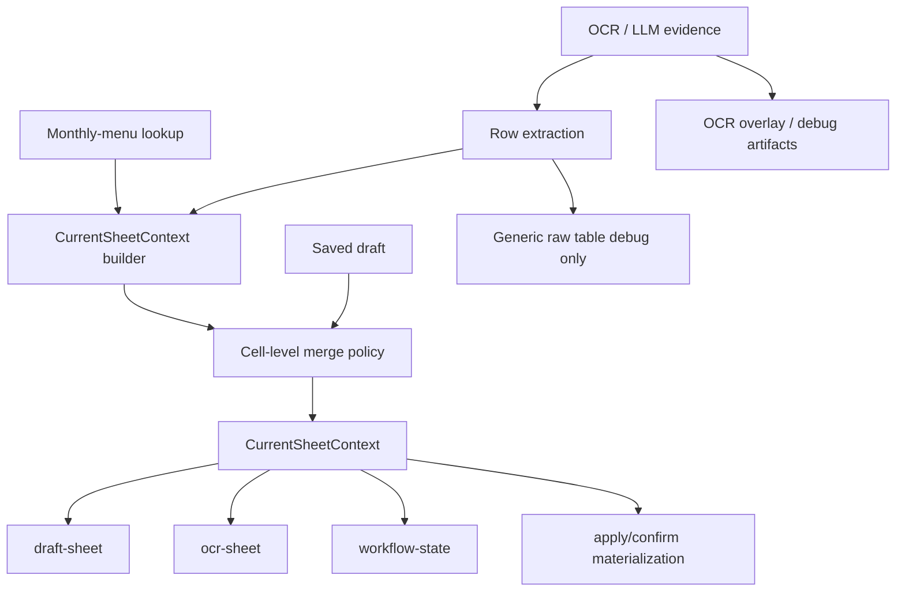

# Current Sheet Canonicalization Plan 2026-04-07

## Goal

The current order-detail stack still has multiple competing truths:

- `draft-sheet`
- `ocr-sheet`
- `workflow-state`
- apply/confirm materialization
- saved draft / revision backfill
- current vs candidate OCR evidence

The target design is:

1. The current editor always shows a semantic sheet.
2. `date`, `daypart`, and `menu` are always present in the current sheet.
3. Generic raw columns (`col1`, `col2`, `col3`, ...) never appear in the current editor.
4. Monthly-menu lookup failures affect diagnostics and apply policy, not whether the current sheet exists.
5. `draft-sheet`, `ocr-sheet`, `workflow-state`, and confirm/materialization all read the same current-sheet truth.

## Required Invariants

### Current editor invariants

- The current editor must always return semantic fields.
- `date/daypart/menu` must be present even when monthly-menu lookup fails.
- Raw OCR table data may seed the semantic shell.
- Generic raw tables may exist only as debug/recovery artifacts, not as the current editor surface.

### State parity invariants

- `draft-sheet`, `ocr-sheet`, and `workflow-state` must agree on:
  - canonical week
  - current evidence lineage
  - whether the current sheet is semantic
  - menu diagnostics
- Apply/confirm must use the same week/menu basis as the current sheet.

### Merge invariants

- `date/daypart/menu` come from the current semantic shell.
- user-edited quantity and note cells are preserved from the saved draft.
- stale revision history must not silently become the current draft.

## Root Problems Confirmed In Review

### 1. Competing week resolution

Current sheet building uses `_resolve_sheet_week_id(...)`, while `workflow-state` still recomputes menu context from `order.week_code`.

This allows:

- `draft-sheet` to use one week
- `workflow-state` to use another
- apply blockers to drift from the visible sheet

### 2. Ambiguous monthly-menu reason codes

The current code mixes multiple meanings into `weekly_menu_missing` style tokens.

At least these distinct situations exist:

- monthly menu object missing
- monthly menu lookup failed at runtime
- monthly menu exists but target week has no entries
- monthly menu exists but facility-specific scope has no entries
- monthly menu exists but current row identity does not match any entry

These must not be collapsed into one token.

### 3. Revision and rerun paths can still reintroduce stale or generic state

Even after no-draft raw fallback is removed, other paths remain risky:

- revision backfill
- rerun candidate save
- materialization re-resolving week/menu independently
- semantic refresh carrying stale warnings forward

### 4. Warning and blocker layers are still mixed

Current code still promotes sheet-level warnings into apply blockers in multiple places.

That causes:

- diagnostics names to double as policy names
- user-facing causes to become ambiguous
- current sheet and apply policy to remain coupled

## Target Architecture



## Canonical Data Object

Introduce a canonical backend object:

- `CurrentSheetContext`

Recommended fields:

- `order_id`
- `facility_id`
- `resolved_week_id`
- `seed_source`
- `enrichment_source`
- `fields`
- `header`
- `rows`
- `row_ids`
- `row_identities`
- `menu_diagnostics`
- `row_diagnostics`
- `ocr_diagnostics`
- `active_evidence_run_id`
- `candidate_evidence_run_id`

### Responsibilities

`CurrentSheetContext` owns:

- the canonical week used by the current editor
- the semantic shell shown in the current editor
- row-level and order-level diagnostics
- current evidence lineage

It does not own:

- apply/confirm policy
- UI copy
- debug-only raw table rendering

## Monthly-Menu Diagnostics Model

### Order-level diagnostics

- `monthly_menu_object_missing`
- `monthly_menu_lookup_failed`
- `monthly_menu_week_entries_missing`

### Row-level diagnostics

- `monthly_menu_facility_scope_missing`
- `monthly_menu_row_identity_unmatched`
- `monthly_menu_date_outside_week`
- `monthly_menu_daypart_unmatched`
- `monthly_menu_name_unmatched`

### Important rule

These are diagnostics, not apply blockers.

Apply blockers must be translated from diagnostics later.

## Apply Policy Layer

`apply_gate_service` should become a translation layer:

- diagnostics -> policy blockers/warnings

Examples:

- `monthly_menu_object_missing`
  -> `apply_blocked_missing_monthly_menu_basis`
- `monthly_menu_week_entries_missing`
  -> `apply_blocked_missing_week_entries`
- `numeric_trust_low`
  -> `apply_blocked_unreviewed_numeric_cells`

This separates:

- what happened
- why apply is blocked

## Canonical Week Policy

### Current problem

The system currently mixes:

- `order.week_code`
- `resolved_week_id`
- candidate-resolution week

### Target rule

`CurrentSheetContext.resolved_week_id` is the canonical read-time week for:

- `draft-sheet`
- `ocr-sheet`
- `workflow-state`
- apply/confirm

`order.week_code` remains persisted state, but is not allowed to override read-time current-sheet truth by itself.

## Current Sheet Construction Policy

### Input sources

- OCR/LLM evidence
- raw OCR table rows
- current evidence run
- monthly-menu lookup
- saved draft for merge only

### Build rules

1. Extract a semantic shell from OCR/LLM evidence and raw OCR table rows.
2. Ensure `date/daypart/menu` exist for every current-sheet row.
3. Use monthly-menu data to enrich, normalize, and diagnose.
4. If monthly-menu lookup fails, keep the semantic shell and attach diagnostics.
5. Never downgrade to generic `colN` in the current editor.

## Saved Draft Merge Policy

Saved draft should not own the whole current sheet.

It only owns user-editable cells.

### Canonical merge rules

- shell-owned by current context:
  - `date`
  - `daypart`
  - `menu`
  - canonical row identity

- saved-draft-owned:
  - `qty.*`
  - `remarks`
  - explicit user-edited auxiliary cells

### Row identity

Canonical row identity should be based on:

- normalized date
- normalized daypart
- normalized menu name
- optional stable fallback such as `source_row_index`

This identity must be shared by:

- semantic refresh
- saved-draft merge
- row diagnostics
- materialization

## Revision and Rerun Policy

### Revision backfill

Current-sheet reads must not silently backfill from legacy revision history unless the operator explicitly requests recovery.

Recommended change:

- normal `get_latest_sheet_draft()` read path should prefer `CurrentSheetContext`
- revision backfill should be explicit recovery only

### Rerun candidate save

Candidate/rerun save paths must also use semantic shell construction.

Recommended change:

- do not create `col1..colN` candidate drafts
- generic raw tables may be stored only as debug artifacts

### Current vs candidate ownership

- `CurrentSheetContext` uses current evidence only
- candidate evidence is carried separately
- candidate success does not change the visible current sheet until explicitly adopted

## Confirm / Materialization Policy

Current confirm/materialization paths still re-resolve week/menu independently.

Recommended change:

- confirm/materialization reads `CurrentSheetContext.resolved_week_id`
- confirm/materialization reads `CurrentSheetContext.row_identities`
- confirm/materialization may re-evaluate quantity trust
- confirm/materialization must not choose a different week/menu basis than the current editor

## Source Model Cleanup

Current `source` strings are overloaded.

Split them into:

- `seed_source`
  - `ocr_table`
  - `saved_draft`
  - `weekly_menu`
- `enrichment_source`
  - `ocr_payload`
  - `monthly_menu`
  - `position_fallback`
- diagnostics
  - `ocr_numeric_review_required`
  - `monthly_menu_week_entries_missing`
  - etc.

The word `fallback` should be reserved for actual degraded representations, not any sheet seeded from OCR tables.

## Implementation Plan

### Phase 1: Introduce `CurrentSheetContext`

Target files:

- [order_service.py](/Users/mmorinag/Sawa/2025.12/workspace/backend/src/services/order_service.py)
- optional new [current_sheet_context_service.py](/Users/mmorinag/Sawa/2025.12/workspace/backend/src/services/current_sheet_context_service.py)

Tasks:

- add canonical builder
- return semantic shell and diagnostics
- compute canonical `resolved_week_id`

### Phase 2: Move `draft-sheet` to canonical context

Target files:

- [orders.py](/Users/mmorinag/Sawa/2025.12/workspace/backend/src/api/orders.py)
- [order_service.py](/Users/mmorinag/Sawa/2025.12/workspace/backend/src/services/order_service.py)

Tasks:

- no-draft bootstrap uses `CurrentSheetContext`
- saved draft merge becomes cell-level only
- generic current draft prohibited

### Phase 3: Move `workflow-state` to canonical context

Target files:

- [workflow_state_service.py](/Users/mmorinag/Sawa/2025.12/workspace/backend/src/services/workflow_state_service.py)

Tasks:

- remove `_build_menu_context()` as independent owner
- consume `CurrentSheetContext.menu_diagnostics`
- consume canonical `resolved_week_id`

### Phase 4: Split diagnostics and blocker policy

Target files:

- [apply_gate_service.py](/Users/mmorinag/Sawa/2025.12/workspace/backend/src/services/apply_gate_service.py)

Tasks:

- replace ambiguous `weekly_menu_missing` style promotions
- translate diagnostics into policy blockers
- keep diagnostics names intact for UI/logging

### Phase 5: Align confirm/materialization

Target files:

- [order_service.py](/Users/mmorinag/Sawa/2025.12/workspace/backend/src/services/order_service.py)

Tasks:

- consume canonical week from `CurrentSheetContext`
- stop re-resolving week/menu independently
- keep row identity and shell parity with current editor

### Phase 6: Remove generic re-entry paths

Target files:

- [order_service.py](/Users/mmorinag/Sawa/2025.12/workspace/backend/src/services/order_service.py)

Tasks:

- revision backfill restricted to explicit recovery
- rerun candidate save uses semantic shell
- generic raw draft remains debug-only

## Test Plan

### Unit tests

Add focused coverage for:

- canonical week resolution
- diagnostics classification
- row identity normalization
- saved-draft merge policy
- diagnostics-to-blocker translation

Suggested files:

- [test_current_sheet_context_service.py](/Users/mmorinag/Sawa/2025.12/workspace/backend/tests/unit/test_current_sheet_context_service.py)
- [test_apply_gate_service.py](/Users/mmorinag/Sawa/2025.12/workspace/backend/tests/unit/test_apply_gate_service.py)

### Integration tests

Required cases:

1. no saved draft + monthly menu object missing
   - `draft-sheet` remains semantic

2. no saved draft + week entries missing
   - `draft-sheet` remains semantic

3. no saved draft + facility scope missing
   - `draft-sheet` remains semantic

4. no saved draft + row identity unmatched
   - `draft-sheet` remains semantic

5. saved draft present
   - shell fields preserved from current context
   - user quantity edits preserved

6. `draft-sheet`, `ocr-sheet`, and `workflow-state`
   - same `resolved_week_id`
   - same diagnostics basis

7. confirm/materialization
   - same canonical week as current sheet

8. rerun candidate
   - never produces current generic `colN` draft

Suggested existing targets:

- [test_draft_sheet_service.py](/Users/mmorinag/Sawa/2025.12/workspace/backend/tests/integration/test_draft_sheet_service.py)
- [test_workflow_state_service.py](/Users/mmorinag/Sawa/2025.12/workspace/backend/tests/integration/test_workflow_state_service.py)
- [test_ocr_redesign_phase_support.py](/Users/mmorinag/Sawa/2025.12/workspace/backend/tests/integration/test_ocr_redesign_phase_support.py)

Suggested new targets:

- [test_current_sheet_context_service.py](/Users/mmorinag/Sawa/2025.12/workspace/backend/tests/integration/test_current_sheet_context_service.py)
- [test_confirm_materialization_context.py](/Users/mmorinag/Sawa/2025.12/workspace/backend/tests/integration/test_confirm_materialization_context.py)

### Contract tests

API-level requirements:

- `draft-sheet` never returns generic `colN` fields for current editor
- `draft-sheet` exposes canonical week context
- `workflow-state` exposes decomposed diagnostics or their structured projection
- source metadata is split into seed/enrichment semantics

Suggested files:

- [test_orders_workflow_state_api.py](/Users/mmorinag/Sawa/2025.12/workspace/backend/tests/contract/test_orders_workflow_state_api.py)
- [test_orders_ocr_status_api.py](/Users/mmorinag/Sawa/2025.12/workspace/backend/tests/contract/test_orders_ocr_status_api.py)

### Full backend verification

Required command:

```bash
cd /Users/mmorinag/Sawa/2025.12/workspace/backend
uv run pytest tests/contract tests/integration -q
```

Success condition:

- full green
- no generic current-draft regressions
- parity coverage for `draft-sheet / ocr-sheet / workflow-state`

## Live Verification Plan

For any production-visible fix, verify on the exact reported order:

- worker `/orders/{id}/draft-sheet`
- worker `/orders/{id}/ocr-sheet`
- worker `/orders/{id}/workflow-state`
- web `/api/orders/{id}/draft-sheet`
- web `/api/orders/{id}/ocr-sheet`
- web `/api/orders/{id}/workflow-state`

Required checks:

- `draft_id = null` still returns semantic fields
- `date/daypart/menu` are present
- canonical week matches across all surfaces
- diagnostics are decomposed, not collapsed into ambiguous `weekly_menu_missing`
- apply blocker names are policy names, not raw diagnostic names
- no `colN` current-editor representation appears

## Rollout Order

1. Introduce canonical context
2. Switch `draft-sheet`
3. Split diagnostics
4. Switch `workflow-state`
5. Switch `apply_gate`
6. Switch confirm/materialization
7. remove generic re-entry paths
8. full backend validation
9. exact-order live verification

## Definition of Done

This redesign is done only when all of the following are true:

- current editor is always semantic
- `date/daypart/menu` always exist
- `draft-sheet`, `ocr-sheet`, and `workflow-state` share one week/menu truth
- monthly-menu causes are decomposed into distinct diagnostics
- apply/confirm reads the same canonical context as the current editor
- generic `colN` current drafts cannot re-enter through rerun, revision, or recovery paths
