# 日別出力 操作マニュアル
## stg live / スクショ付き

対象: 日別出力、当日注文一覧、個別出力、数量監査、施設別単位設定
作成: 2026-05-19 10:45 JST / 現行stg版

---

# 全体フローチャート

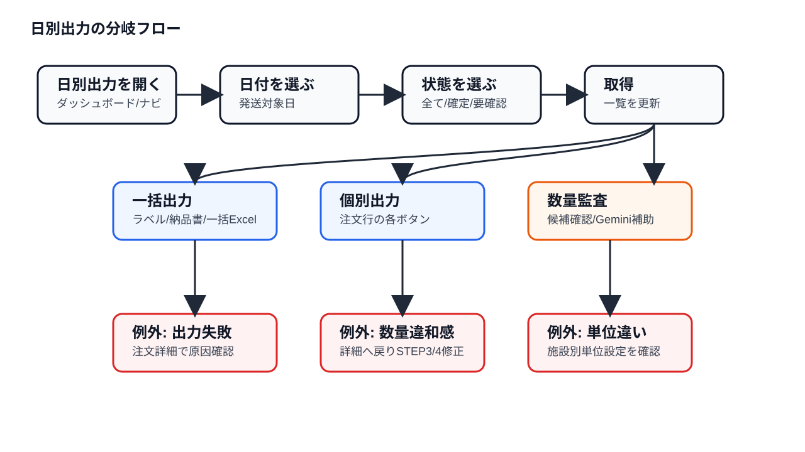

---

# 日別出力の役割

- 発送日を軸に、確定済み注文のラベル・納品書・一括Excelを出す。
- 数量や施設/週を根本修正する画面ではない。
- 違和感があれば、注文行の `詳細` から注文詳細へ戻る。

---

# 入口: ダッシュボードから日別出力へ

操作: `日別出力へ` を押す。
使う場面: 発送日単位で出力物を作る、または数量監査を見る。

分岐:
- 注文自体を直す: `注文一覧へ` から注文詳細へ。
- PDF登録から始める: `注文書アップロードへ`。

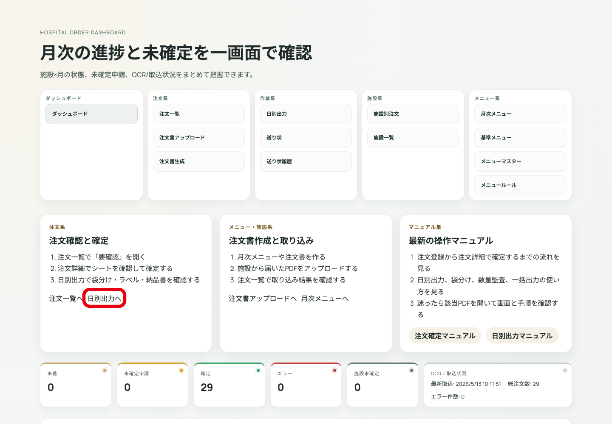

---

# 日別出力: 画面全体

確認: 見出しが `日別出力` になっている。
上から、フィルタ、一括出力、当日注文一覧、袋分け/監査を確認する。

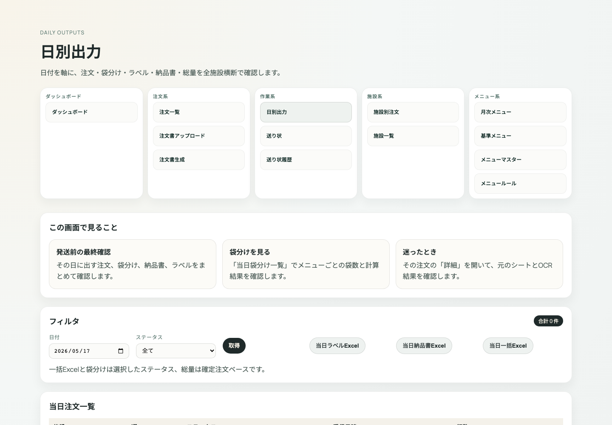

---

# 操作1: 日付を選ぶ

操作: 日付入力で発送対象日を選ぶ。
基準: 出力したいラベル/納品書の日付。

分岐:
- 注文が出ない: 日付が違う可能性あり。
- 週単位の注文確認: 注文詳細/注文一覧で確認。

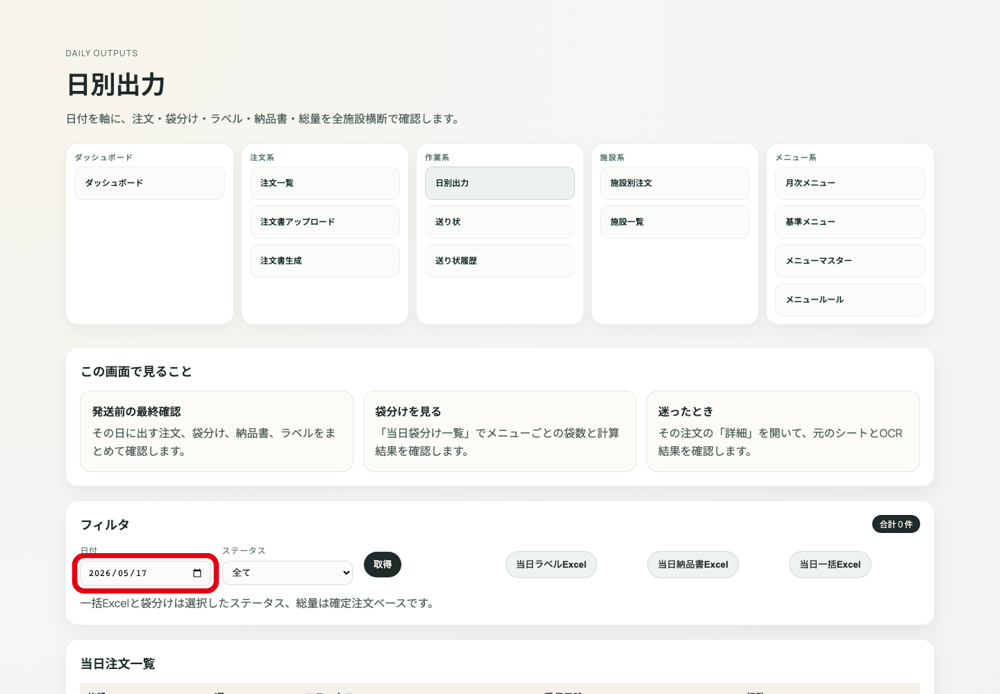

---

# 操作2: ステータスを選ぶ

操作: ステータスフィルタを選ぶ。
通常の出力は `確定` を使う。

分岐:
- `全て`: 状況確認用。
- `要確認`: まだ出力対象にしない注文の確認。
- `確定`: 出力対象。
- `エラー`: 処理失敗の調査。

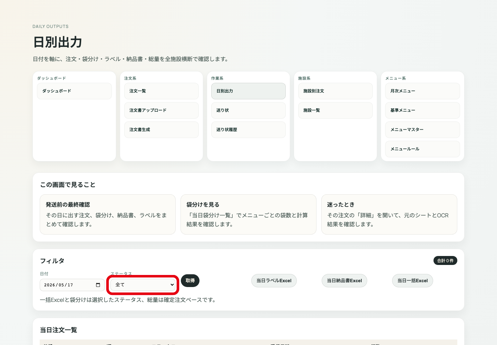

---

# 操作3: 取得する

操作: `取得` を押す。
結果: 選んだ日付・ステータスで一覧が更新される。

分岐:
- 件数あり: 一覧と出力へ進む。
- 件数なし: 日付、ステータス、注文確定状態を見直す。

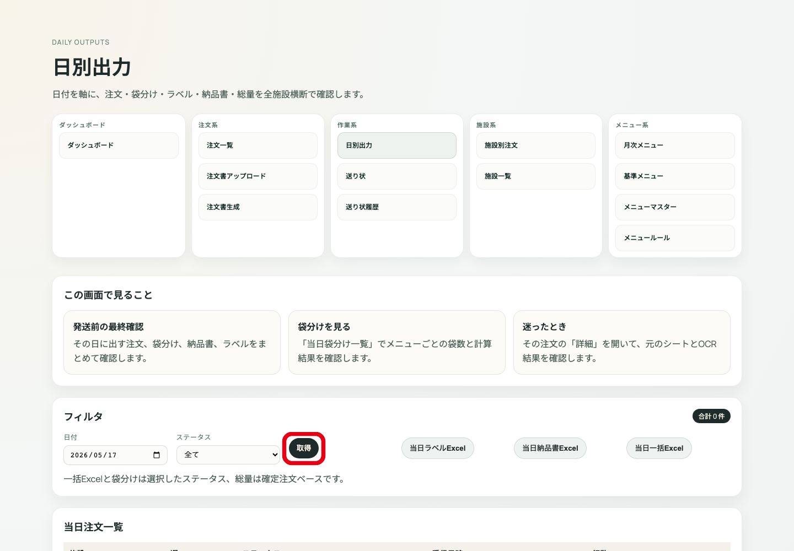

---

# 操作4: 当日ラベルExcelを出す

操作: `当日ラベルExcel` を押す。
対象: 選択中の日付・ステータスの注文。

分岐:
- 成功: Excelを開いて施設・数量を確認。
- 失敗: 一覧で失敗注文を探し、個別出力または詳細へ。

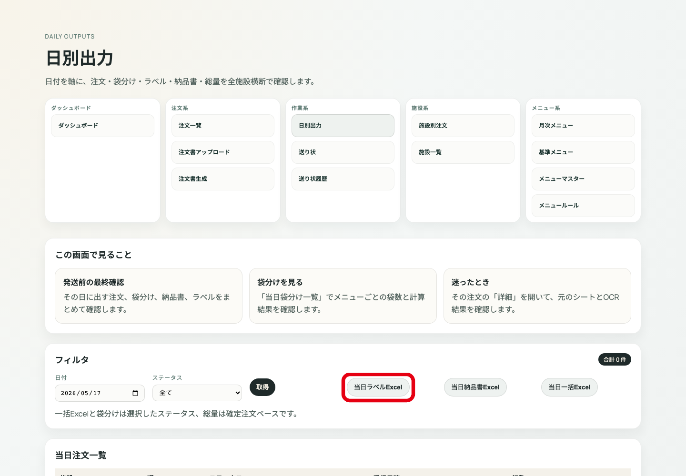

---

# 操作5: 当日納品書Excelを出す

操作: `当日納品書Excel` を押す。
確認: 施設名、日付、品目、数量。

分岐:
- 数量違和感: 該当注文の詳細へ戻る。
- 出力失敗: 個別納品書で切り分ける。

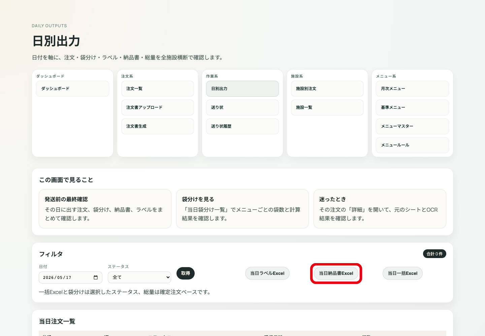

---

# 操作6: 当日一括Excelを出す

操作: `当日一括Excel` を押す。
用途: ラベル、納品書、関連出力をまとめて取得する。

分岐:
- 一部失敗: 当日注文一覧から個別出力で原因を切り分ける。
- 対象が少ない/多い: 日付・ステータスを見直す。

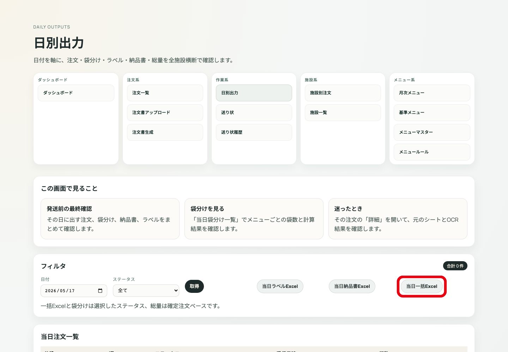

---

# 出力エリア: 表示内容の意味

上部の出力エリアは、選択中の `日付` と `ステータス` を条件にファイルを作ります。

- `当日ラベルExcel`: 現場貼付用のラベルを日別にまとめて出す。
- `当日納品書Excel`: 納品書を日別にまとめて出す。
- `当日一括Excel`: ラベルと納品書をまとめて取得する。
- `週別重量表`: 選択日を含む週の重量表へ移動する。

注意: 一括Excelと袋分けは選択ステータス、総量は確定注文ベースです。

---

# 当日注文一覧: 表示情報の意味

一覧は、選択日付に該当する注文を注文単位で確認する場所です。

- `施設`: 出力対象施設。施設違いがあれば注文詳細で確認する。
- `週`: 注文が紐づく週。日付と週が合わない場合は詳細で戻る。
- `ステータス`: `確定` が通常の出力対象。
- `受信日時`: 元PDF/注文が登録された日時。
- `行数`: 注文明細の行数。極端に少ない/多い場合は詳細確認する。
- 右端操作: 個別ラベル、個別納品書、総量CSV、詳細への戻り口。

---

# 当日注文一覧: 個別ラベル

操作: 注文行の `ラベル` を押す。
使う場面: 1注文だけラベルを確認・再出力したいとき。

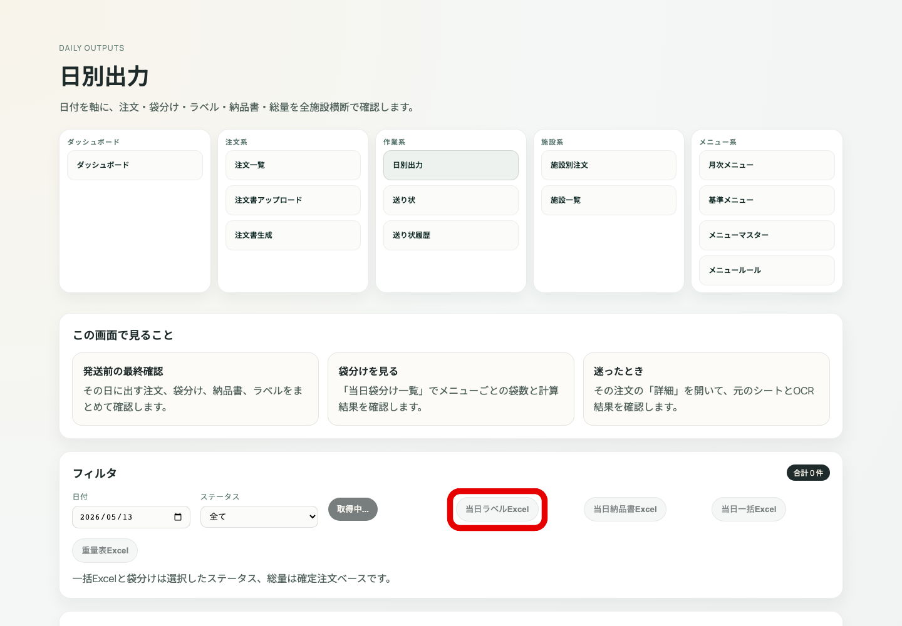

---

# 当日注文一覧: 個別納品書

操作: 注文行の `納品書` を押す。
使う場面: 1注文だけ納品書を確認・再出力したいとき。

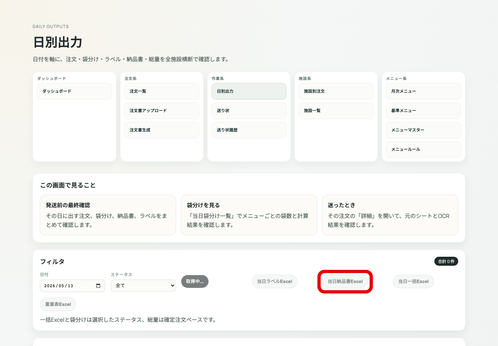

---

# 当日注文一覧: 総量CSV

操作: 注文行の `総量CSV` を押す。
使う場面: 製造・集計用に1注文の総量を確認する。

分岐:
- 数量がおかしい: 注文詳細STEP3へ戻る。
- 単位がおかしい: 施設別単位設定を確認。

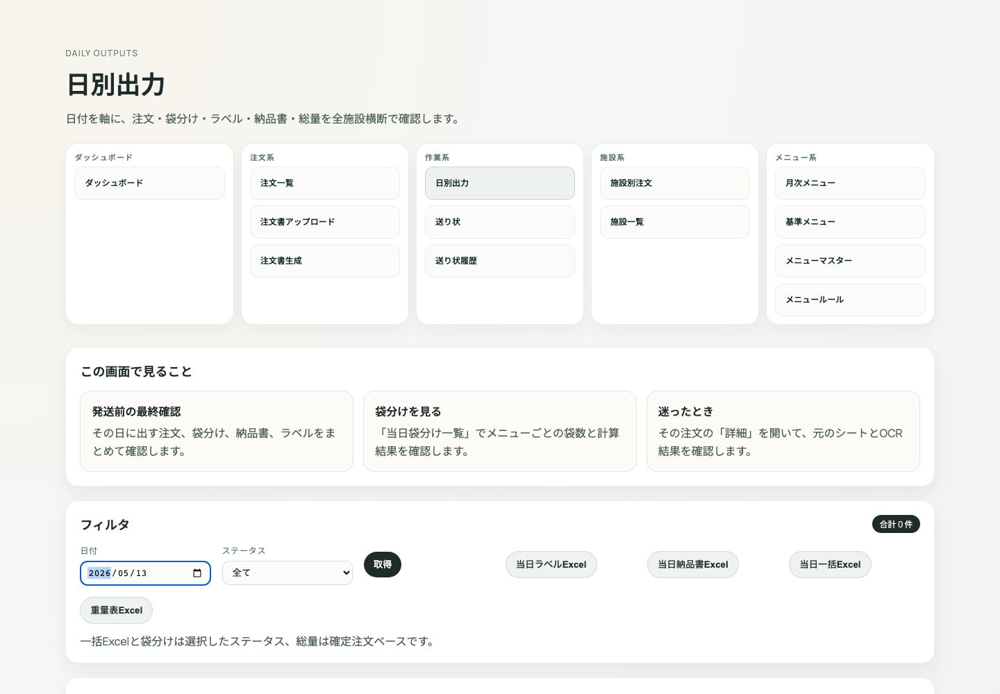

---

# 当日注文一覧: 詳細へ戻る

操作: 注文行の `詳細` を押す。
使う場面: 日別出力で違和感を見つけたとき。

戻り先:
- 施設/週: STEP1
- OCR値: STEP2
- 明細数量: STEP3
- 袋分け/出力: STEP4

---

# 数量監査: Gemini補助

操作: `Gemini` / AI監査ボタンを押す。
用途: 日別数量から確認候補を出す補助。

注意:
- AI結果だけで数量を確定しない。
- 修正は必ず注文詳細で行う。

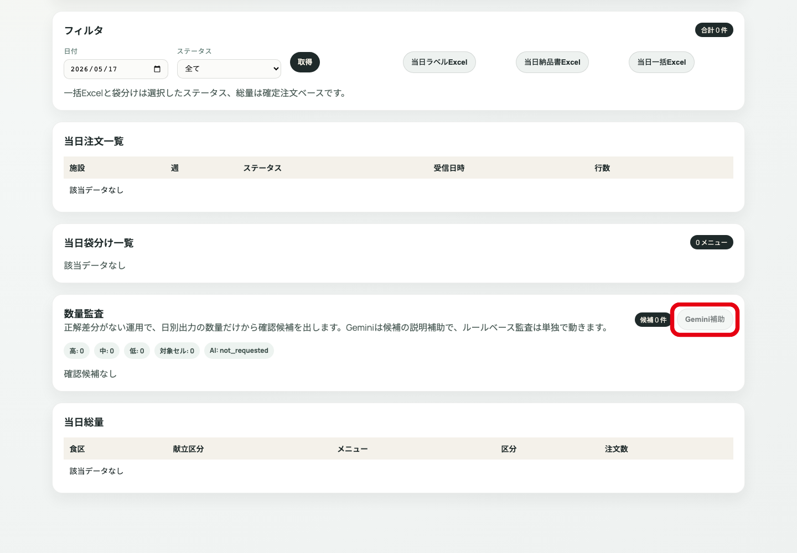

---

# 施設別単位設定を開く

操作: `施設別単位設定` を押す。
使う場面: ラベル/袋分け/総量の単位が施設運用と違うとき。

分岐:
- 単位だけが違う: 設定を確認。
- 明細数量が違う: 注文詳細STEP3へ戻る。

---

# 施設別単位設定: 分岐

- 施設全体の単位を変える: 施設、食種、単位、換算値を確認して保存。
- 1行だけ単位を変える: 対象行を選び、単位/換算値を保存。
- 設定を消す: 削除対象が正しいことを確認して削除。
- 判断不能: 削除・保存せず、注文詳細と施設マスターを確認する。

※この操作は設定変更の副作用があるため、実施前に施設・食種・対象日を必ず確認する。

---

# 出力失敗時の戻り方

- 一括ラベル失敗: 個別ラベルで対象注文を特定する。
- 一括納品書失敗: 個別納品書で対象注文を特定する。
- 総量CSVが変: 注文詳細STEP3で明細数量を確認する。
- 袋分けが変: 注文詳細STEP4で袋分け計算と施設単位を確認する。
- 注文が一覧に出ない: 注文一覧で状態が `確定` か確認する。

---

# 日別出力の完了条件

- 日付とステータスが正しい。
- 当日注文一覧に対象注文がそろっている。
- 個別または一括のラベル/納品書が出力できる。
- 数量監査で違和感がない、または注文詳細で修正済み。
- 施設別単位設定の例外が必要な場合は、対象施設/食種を確認済み。
