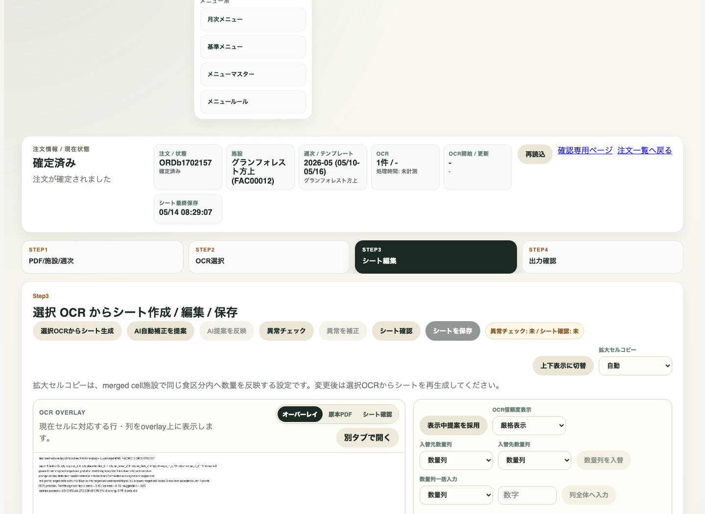

# 注文処理 workflow-v2 詳細マニュアル
現行stg liveスクショ版

- 対象URL: https://web-stg-avlnzjjrca-dt.a.run.app/orders/ORDb1702157/workflow-v2
- 注文ID: ORDb1702157
- 取得日時: 2026年5月19日火曜日 9:20:39 JST
- stg revision: web-stg-00200-xf6
- buildId: hU_EpWS8vP9LhGph2MCQk

---

## 全体フロー

```text
週次または注文一覧から workflow-v2 を開く
  -> Step1 PDF/施設/週次: 原本PDF、施設、週、OCR方式を確認
  -> OCRを実行: OCR結果を作る
  -> Step2 OCR選択: 採用するOCR結果を選ぶ
  -> Step3 シート編集: シート生成、補正、異常チェック、確認、保存
  -> Step4 出力確認: 袋分け・ラベル・納品書・総量を作成
  -> 確定して一覧にもどる

分岐:
- 施設または週が違う: Step1で選び直し、設定を保存してからOCRを実行
- 通常週でない: 例外範囲を指定して反映
- OCR候補が複数: Step2で採用候補を選択
- シートに不一致・不足: Step3で補正、再チェック、シート保存
- 出力内容に問題: Step3へ戻り、保存後にStep4で出力確認を再作成
```

---

## 1. workflow-v2画面を開く


- 画面上部に **注文処理 v2** と表示されていることを確認します。
- 旧URLの注文詳細ではなく、必ず末尾が **/workflow-v2** の画面を使います。
- 現在状態、施設、週次、シート最終保存時刻をここで確認します。

---

## 2. Step1へ移動する


- **STEP1 PDF/施設/週次** を押します。
- 原本PDF、施設、週、OCR実行方式の確認画面へ移動します。

---

## 3. 施設を確認・変更する


- 施設プルダウンで注文書の施設と一致しているか確認します。
- 違う場合は正しい施設を選び直します。
- PDF自動推定候補が出ている場合は、内容を見て **推定を反映** を使う分岐があります。

---

## 4. 週を確認・変更する


- 週プルダウンで対象週を選びます。
- 通常は日曜から土曜の固定週です。
- 注文書と違う週が選ばれている場合は、ここで正しい週へ変更します。

---

## 5. 例外範囲がある場合


- 通常週では処理できない注文だけ、**例外範囲を指定する** を開きます。
- 通常週で問題ない場合は、この操作は不要です。

---

## 6. 例外範囲を反映する


- 例外日付の開始・終了を指定した後、反映ボタンを押します。
- この画面では推定候補がある場合、**推定を反映** が使えます。
- 反映後に施設・週の表示が注文書と一致しているか再確認します。

---

## 7. 設定を保存する


- 施設、週、拡大セルコピー、OCR方式を確認して **設定を保存** を押します。
- 施設区分列の変更が必要な場合は、下部の **列設定を確認/修正**、**施設区分列を保存** を使います。
- 保存しないままOCRを進めると、誤った施設・週で後続処理に入るため注意します。

---

## 8. OCR実行方式を選ぶ


- 通常は **箱館方式** を選びます。
- レイアウトや読取が通常方式に合わない場合だけ **AIに任せる** を選びます。
- 拡大セルコピーは施設テンプレート設定に従うため、基本は **自動** です。

---

## 9. OCRを実行する


- 施設・週・OCR方式を確認後、**OCRを実行** を押します。
- 押下後は結果作成が終わるまで待ちます。
- 実行できない場合は、施設・週・テンプレート未設定がないか確認します。

---

## 10. 原本PDFを確認する


- 原本PDFで施設名、週、数量、食区分を見比べます。
- **原本を開く** から別画面で拡大確認できます。
- PDF表示が読み込み中のままなら再読込し、同じ注文のworkflow-v2を開き直します。

---

## 11. Step2 OCR選択へ移動する


- **STEP2 OCR選択** を押します。
- OCR実行後に、採用するOCR結果をここで確認します。

---

## 12. OCR結果を選ぶ


- 複数候補がある場合は、原本PDFと一致する候補を選びます。
- 既に確定済みの注文では、選択済みOCRを確認する用途になります。
- 候補がない場合はStep1へ戻り、OCR方式と施設・週設定を確認して再実行します。

---

## 13. Step3 シート編集へ移動する


- **STEP3 シート編集** を押します。
- OCRから作った注文シートを確認・編集・保存する画面です。

---

## 14. シート生成・補正・保存



- **選択OCRからシート生成**: 採用OCRからシートを作ります。
- **AI自動補正を提案**: 数量や読み取りの補正案を作ります。
- **AI提案を反映**: 提案を確認後に反映します。
- **異常チェック**: 数量や列の異常を確認します。
- **異常を補正**: 異常がある場合に補正します。
- **シート確認**: 保存前に内容を確認します。
- **シートを保存**: 確認済みのシートを保存します。ここが抜けるとStep4の出力が古い内容になります。

---

## 15. シート編集の分岐


- OCR overlay: セルに対応するOCR行・列を見て、原本PDFとの対応を確認します。
- 原本PDF: 読み取り元PDFを見直します。
- シート確認: 保存前のシート内容を確認します。
- 数量列入替・列全体へ入力: 数量列の対応がずれている場合だけ使用します。
- 補正後は必ず **異常チェック** と **シートを保存** を行います。

---

## 16. Step4 出力確認へ移動する


- **STEP4 出力確認** を押します。
- 袋分け、ラベル、納品書、総量の出力を確認する画面です。

---

## 17. 出力を作成・確認する


- **出力確認を作成** を押して、最新保存シートから出力確認を作ります。
- 袋分け結果、対象行、数量行、合計数量、袋数を確認します。
- ラベル、納品書、総量はそれぞれ **プレビュー** と **ダウンロード** で確認します。

---

## 18. 確定する


- 出力結果に問題がなければ **確定して一覧にもどる** を押します。
- 問題がある場合は確定せず、Step3へ戻ってシートを補正・保存し、Step4で出力確認を作り直します。
- 確定後は状態が **確定済み** になります。

---

## 注意点まとめ

- 旧注文詳細画面ではなく、必ず `/workflow-v2` の画面で作業します。
- Step1の施設・週が正しくないままOCRを実行しません。
- シート編集後は **シートを保存** を押してからStep4へ進みます。
- Step4で出力を作り直した後に確定します。
- PDFや出力に違和感があれば、確定せずStep3またはStep1へ戻ります。
