# 注文処理 workflow-v2 詳細マニュアル
現行stg liveスクショ版

- 対象URL: https://web-stg-avlnzjjrca-dt.a.run.app/orders/ORDb1702157/workflow-v2
- 注文ID: ORDb1702157
- 取得日時: 2026年5月19日火曜日 10:30:00 JST
- stg revision: web-stg-00206-rxc
- buildId: hU_EpWS8vP9LhGph2MCQk

---

## 全体フロー

```text
週次または注文一覧から workflow-v2 を開く
  -> Step1 PDF/施設/週次: 原本PDF、施設、週、OCR方式を確認
  -> OCRを実行: OCR結果を作る
  -> Step2 OCR選択: 採用するOCR結果を選ぶ
  -> Step3 シート編集: シート生成、補正、異常チェック、確認、保存
  -> Step4 出力確認: 袋分け・ラベル・納品書・総量を作成
  -> 確定して一覧にもどる

分岐:
- 施設または週が違う: Step1で選び直し、設定を保存してからOCRを実行
- 通常週でない: 例外範囲を指定して反映
- OCR候補が複数: Step2で採用候補を選択
- シートに不一致・不足: Step3で補正、再チェック、シート保存
- 出力内容に問題: Step3へ戻り、保存後にStep4で出力確認を再作成
```

---

## 1. workflow-v2画面を開く

<div class="split">
  <div class="shot">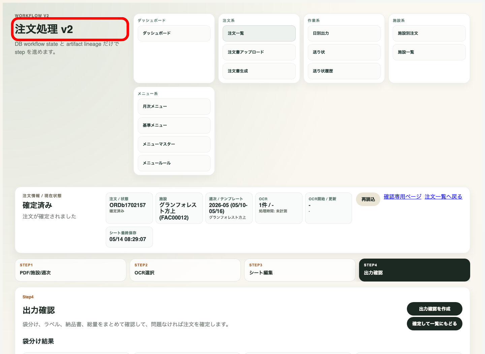</div>
  <div class="notes">
<ul>
<li>画面上部に <strong>注文処理 v2</strong> と表示されていることを確認します。</li>
<li>旧URLの注文詳細ではなく、必ず末尾が <strong>/workflow-v2</strong> の画面を使います。</li>
<li>現在状態、施設、週次、シート最終保存時刻をここで確認します。</li>
</ul>
  </div>
</div>

---

## 2. Step1へ移動する

<div class="split">
  <div class="shot">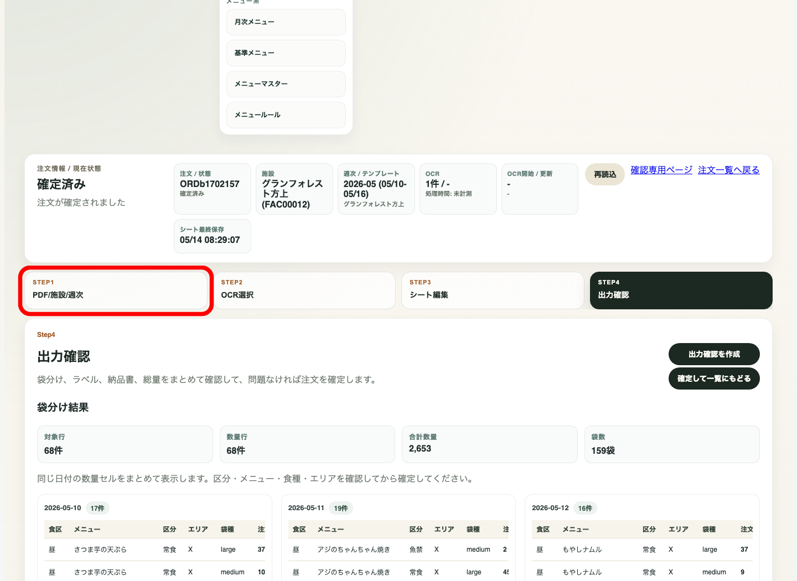</div>
  <div class="notes">
<ul>
<li><strong>STEP1 PDF/施設/週次</strong> を押します。</li>
<li>原本PDF、施設、週、OCR実行方式の確認画面へ移動します。</li>
</ul>
  </div>
</div>

---

## 3. 施設を確認・変更する

<div class="split">
  <div class="shot">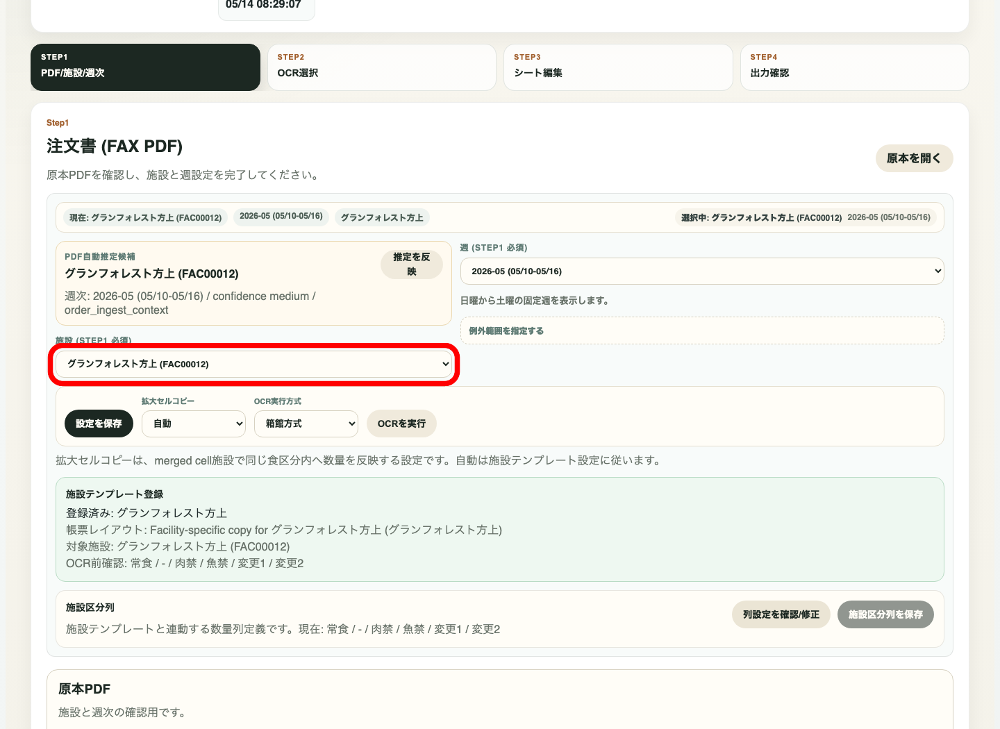</div>
  <div class="notes">
<ul>
<li>施設プルダウンで注文書の施設と一致しているか確認します。</li>
<li>違う場合は正しい施設を選び直します。</li>
<li>PDF自動推定候補が出ている場合は、内容を見て <strong>推定を反映</strong> を使う分岐があります。</li>
</ul>
  </div>
</div>

---

## 4. 週を確認・変更する

<div class="split">
  <div class="shot">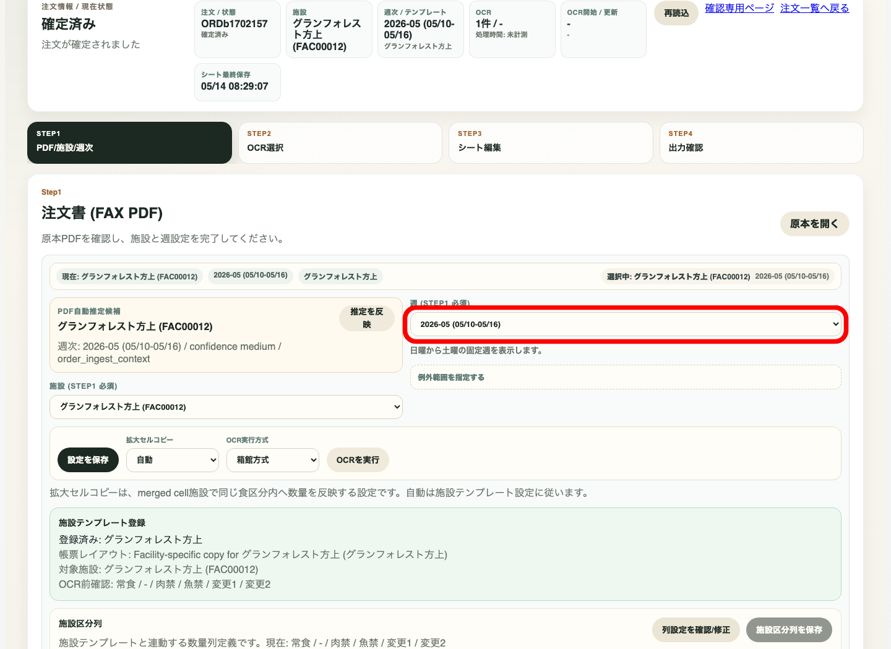</div>
  <div class="notes">
<ul>
<li>週プルダウンで対象週を選びます。</li>
<li>通常は日曜から土曜の固定週です。</li>
<li>注文書と違う週が選ばれている場合は、ここで正しい週へ変更します。</li>
</ul>
  </div>
</div>

---

## 5. 例外範囲がある場合

<div class="split">
  <div class="shot">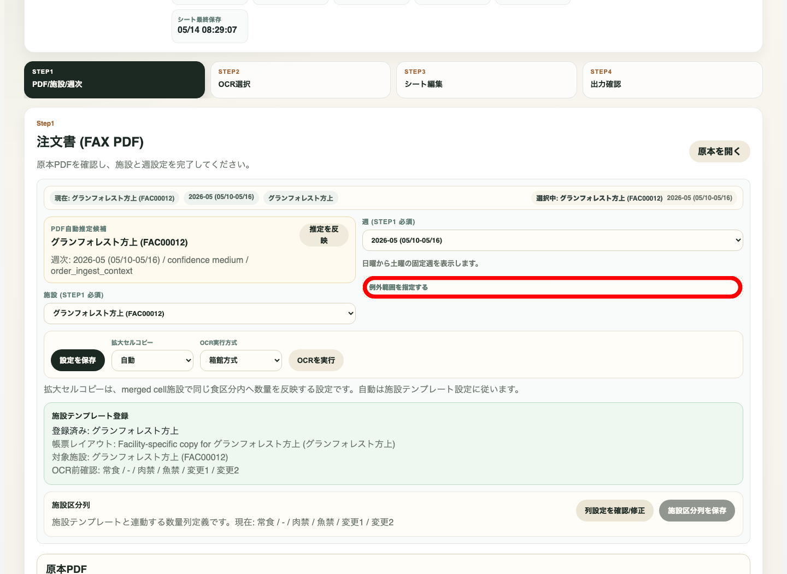</div>
  <div class="notes">
<ul>
<li>通常週では処理できない注文だけ、<strong>例外範囲を指定する</strong> を開きます。</li>
<li>通常週で問題ない場合は、この操作は不要です。</li>
</ul>
  </div>
</div>

---

## 6. 例外範囲を反映する

<div class="split">
  <div class="shot">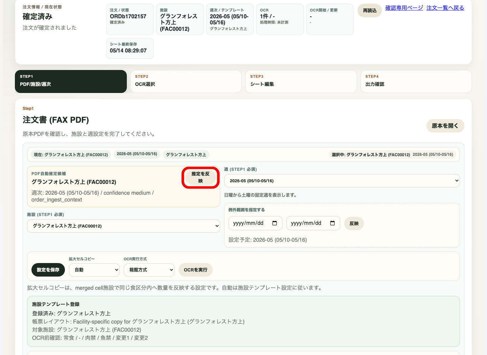</div>
  <div class="notes">
<ul>
<li>例外日付の開始・終了を指定した後、反映ボタンを押します。</li>
<li>この画面では推定候補がある場合、<strong>推定を反映</strong> が使えます。</li>
<li>反映後に施設・週の表示が注文書と一致しているか再確認します。</li>
</ul>
  </div>
</div>

---

## 7. 設定を保存する

<div class="split">
  <div class="shot">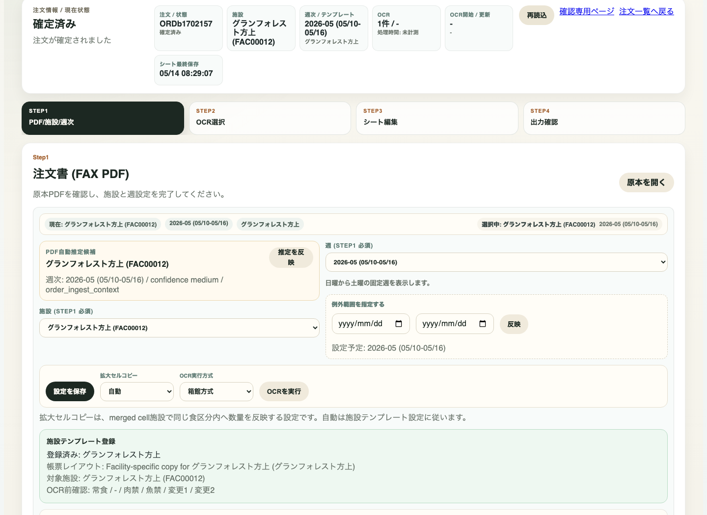</div>
  <div class="notes">
<ul>
<li>施設、週、拡大セルコピー、OCR方式を確認して <strong>設定を保存</strong> を押します。</li>
<li>施設区分列の変更が必要な場合は、下部の <strong>列設定を確認/修正</strong>、<strong>施設区分列を保存</strong> を使います。</li>
<li>保存しないままOCRを進めると、誤った施設・週で後続処理に入るため注意します。</li>
</ul>
  </div>
</div>

---

## 8. OCR実行方式を選ぶ

<div class="split">
  <div class="shot">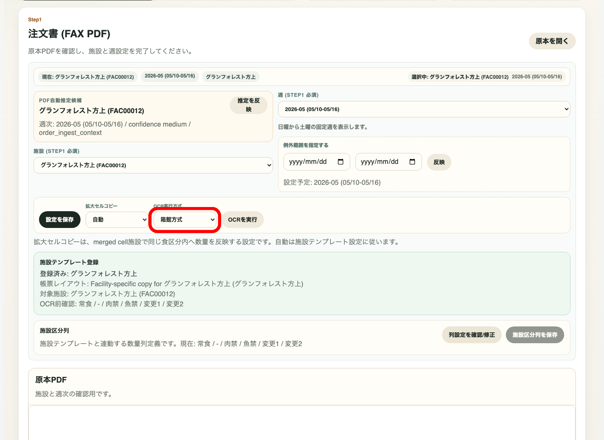</div>
  <div class="notes">
<ul>
<li>通常は <strong>箱館方式</strong> を選びます。</li>
<li>レイアウトや読取が通常方式に合わない場合だけ <strong>AIに任せる</strong> を選びます。</li>
<li>拡大セルコピーは施設テンプレート設定に従うため、基本は <strong>自動</strong> です。</li>
</ul>
  </div>
</div>

---

## 9. OCRを実行する

<div class="split">
  <div class="shot">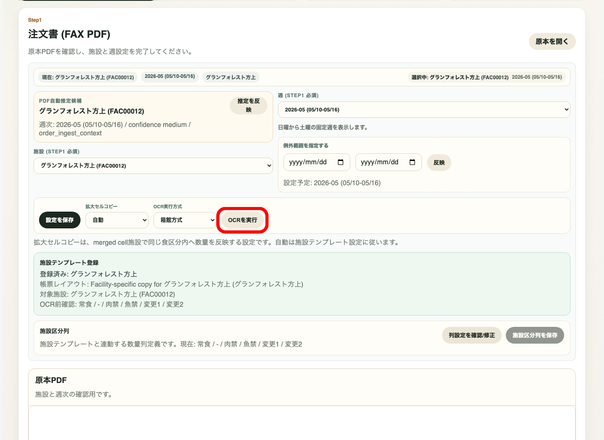</div>
  <div class="notes">
<ul>
<li>施設・週・OCR方式を確認後、<strong>OCRを実行</strong> を押します。</li>
<li>押下後は結果作成が終わるまで待ちます。</li>
<li>実行できない場合は、施設・週・テンプレート未設定がないか確認します。</li>
</ul>
  </div>
</div>

---

## 10. 枠ズレ時の分岐: Step1.5 / Step1.6

<div class="split">
  <div class="shot">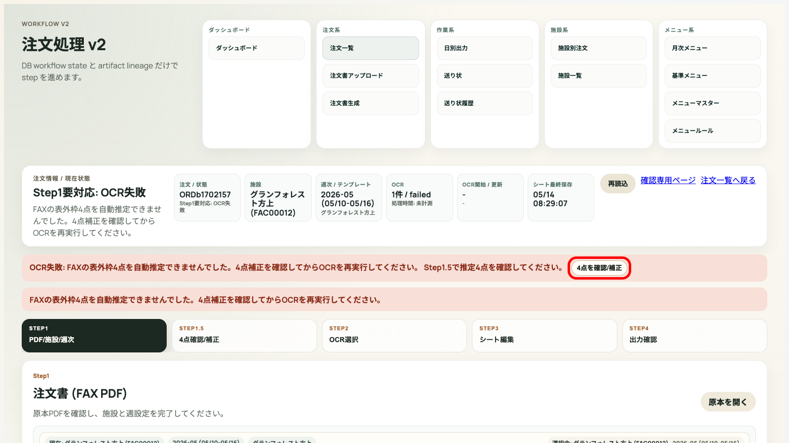</div>
  <div class="notes">
<ul>
<li>OCR実行後に <strong>FAXの表外枠4点を自動推定できませんでした</strong> と表示された場合は、通常のStep2へ進まず <strong>Step1.5 4点確認/補正</strong> を開きます。</li>
<li>赤丸の <strong>4点を確認/補正</strong> から復帰画面へ入ります。</li>
<li>表全体の赤枠がFAX外枠からずれている場合はStep1.5、ヘッダー列線だけがずれている場合はStep1.6を使います。</li>
<li>補正後はOCRが再実行されるため、Step2以降は新しいOCR結果で確認し直します。</li>
</ul>
  </div>
</div>

---

## 11. Step1.5: 推定4点を確認する

<div class="split">
  <div class="shot">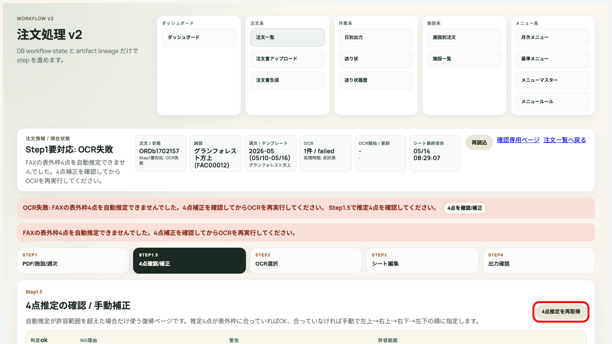</div>
  <div class="notes">
<ul>
<li><strong>4点推定を再取得</strong> で現在の推定結果を取り直します。</li>
<li>推定4点がFAXの表外枠に合っている場合は <strong>推定4点をOKにしてOCR再実行</strong> を押します。</li>
<li>推定4点が外枠からずれている場合は <strong>NG: 手動で4点指定</strong> を押します。</li>
<li>この判断を誤ると、行・列・数量セルの位置がずれたままOCRされます。</li>
</ul>
  </div>
</div>

---

## 12. Step1.5: 手動で4点指定する

<div class="split">
  <div class="shot">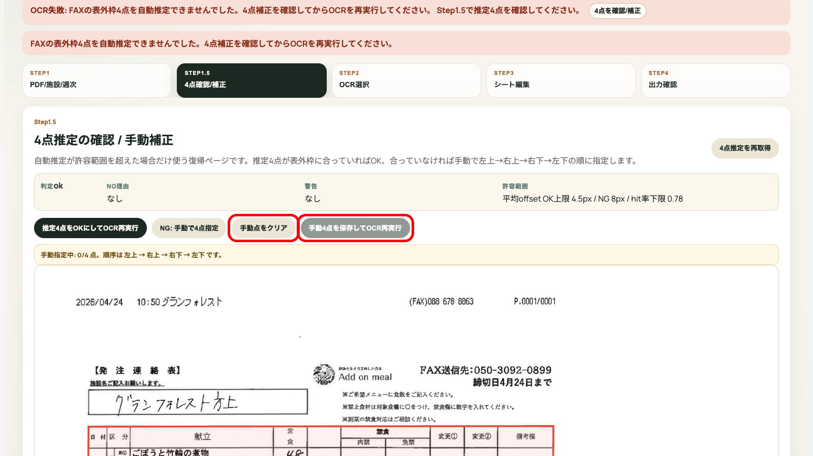</div>
  <div class="notes">
<ul>
<li><strong>NG: 手動で4点指定</strong> を押すと、画像上で4点を指定するモードになります。</li>
<li>指定順は <strong>左上 → 右上 → 右下 → 左下</strong> です。</li>
<li>点を間違えた場合は <strong>手動点をクリア</strong> でやり直します。</li>
<li>4点を置いた後、<strong>手動4点を保存してOCR再実行</strong> を押します。</li>
<li>OCR再実行後はStep2で新しいOCR結果を選び直します。</li>
</ul>
  </div>
</div>

---

## 13. Step1.6: ヘッダー補正へ入る

<div class="split">
  <div class="shot">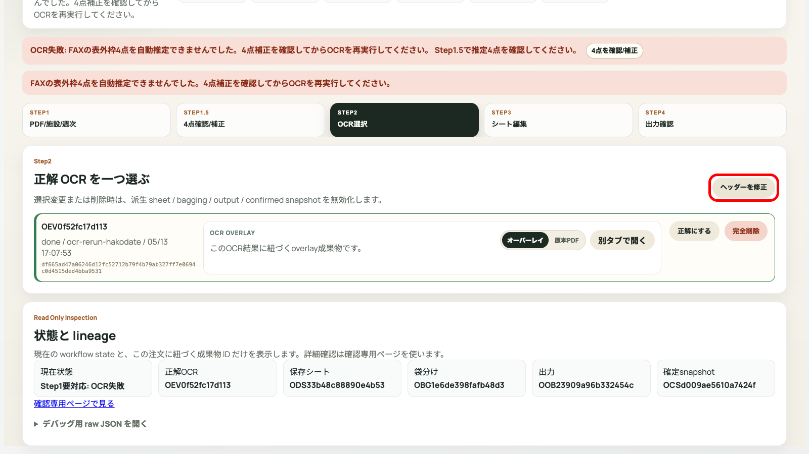</div>
  <div class="notes">
<ul>
<li>OCR overlay上で表外枠は合っているが、数量列の縦線・2段ヘッダーの交点だけがずれている場合はStep1.6を使います。</li>
<li>Step2の <strong>ヘッダーを修正</strong> を押します。</li>
<li>通常のOCR候補選択で問題ない場合、この操作は不要です。</li>
<li>ヘッダー補正後もOCRが再実行されるため、既存のOCR結果をそのまま採用しません。</li>
</ul>
  </div>
</div>

---

## 14. Step1.6: ヘッダー交点を補正する

<div class="split">
  <div class="shot">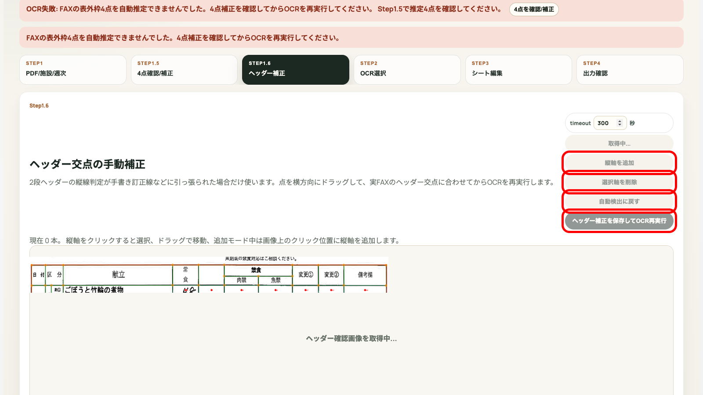</div>
  <div class="notes">
<ul>
<li><strong>ヘッダーを再取得</strong> で現在の検出結果を取り直します。</li>
<li>縦軸をクリックして選択し、ドラッグで実FAXのヘッダー交点へ合わせます。</li>
<li>不足している縦軸は <strong>縦軸を追加</strong>、不要な縦軸は <strong>選択軸を削除</strong> を使います。</li>
<li>やり直す場合は <strong>自動検出に戻す</strong> を押します。</li>
<li>調整後、<strong>ヘッダー補正を保存してOCR再実行</strong> を押します。</li>
</ul>
  </div>
</div>

---

## 10. 原本PDFを確認する

<div class="split">
  <div class="shot">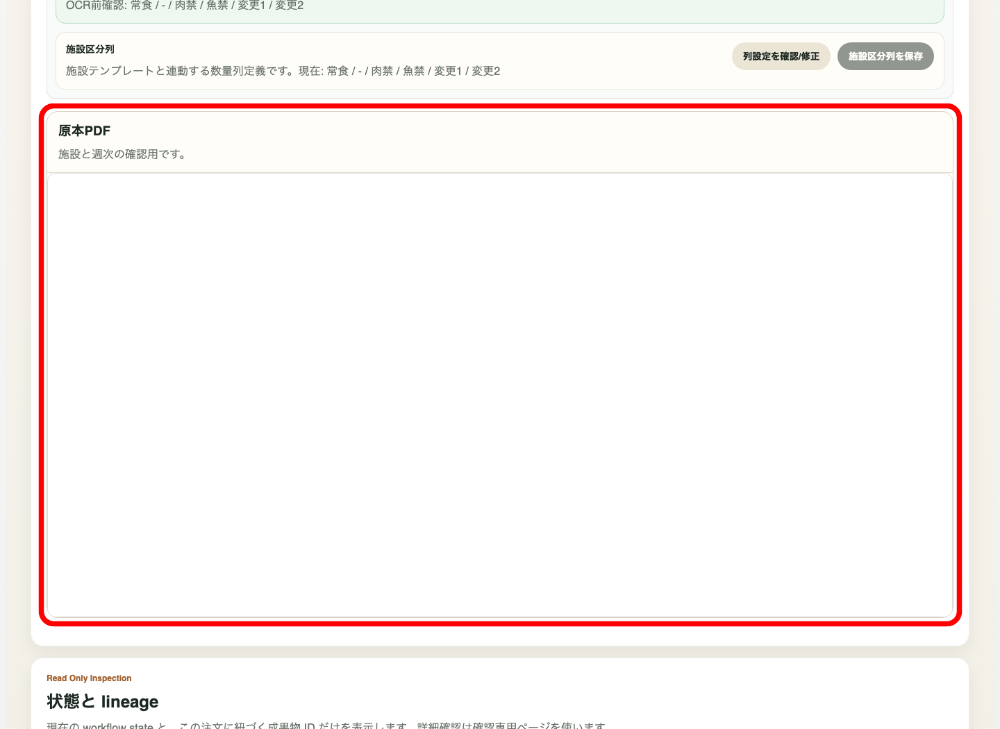</div>
  <div class="notes">
<ul>
<li>原本PDFで施設名、週、数量、食区分を見比べます。</li>
<li><strong>原本を開く</strong> から別画面で拡大確認できます。</li>
<li>PDF表示が読み込み中のままなら再読込し、同じ注文のworkflow-v2を開き直します。</li>
</ul>
  </div>
</div>

---

## 11. Step2 OCR選択へ移動する

<div class="split">
  <div class="shot">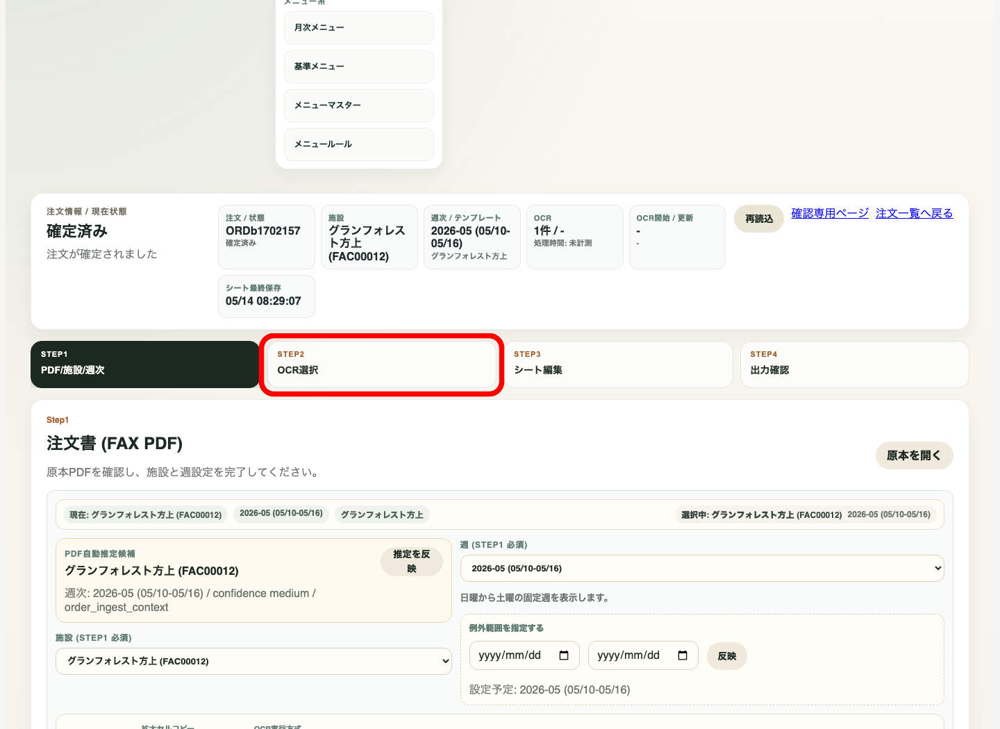</div>
  <div class="notes">
<ul>
<li><strong>STEP2 OCR選択</strong> を押します。</li>
<li>OCR実行後に、採用するOCR結果をここで確認します。</li>
</ul>
  </div>
</div>

---

## 12. OCR結果を選ぶ

<div class="split">
  <div class="shot">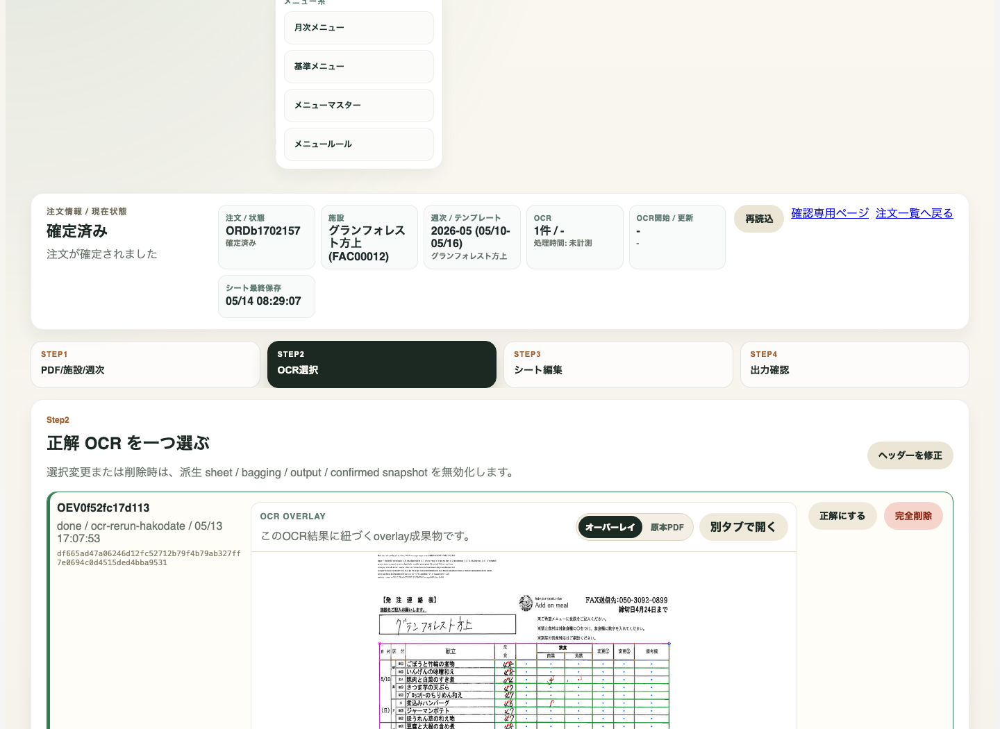</div>
  <div class="notes">
<ul>
<li>複数候補がある場合は、原本PDFと一致する候補を選びます。</li>
<li>既に確定済みの注文では、選択済みOCRを確認する用途になります。</li>
<li>候補がない場合はStep1へ戻り、OCR方式と施設・週設定を確認して再実行します。</li>
</ul>
  </div>
</div>

---

## 13. Step3 シート編集へ移動する

<div class="split">
  <div class="shot">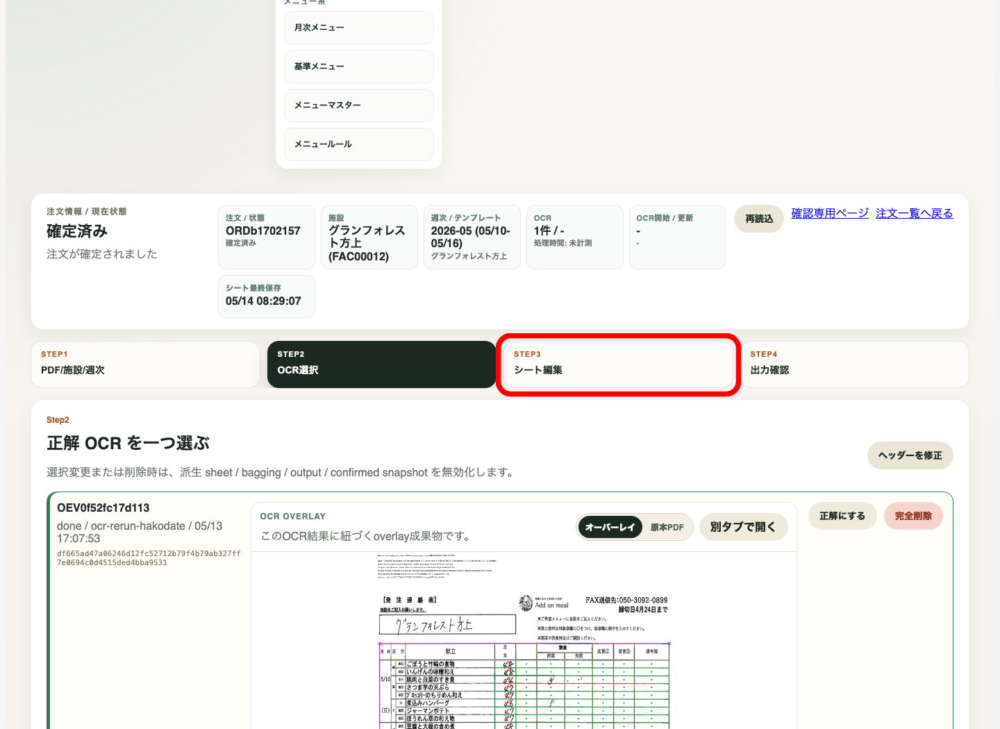</div>
  <div class="notes">
<ul>
<li><strong>STEP3 シート編集</strong> を押します。</li>
<li>OCRから作った注文シートを確認・編集・保存する画面です。</li>
</ul>
  </div>
</div>

---

## 14. Step3の前提: ここが確定前の最重要作業

<div class="split">
  <div class="shot">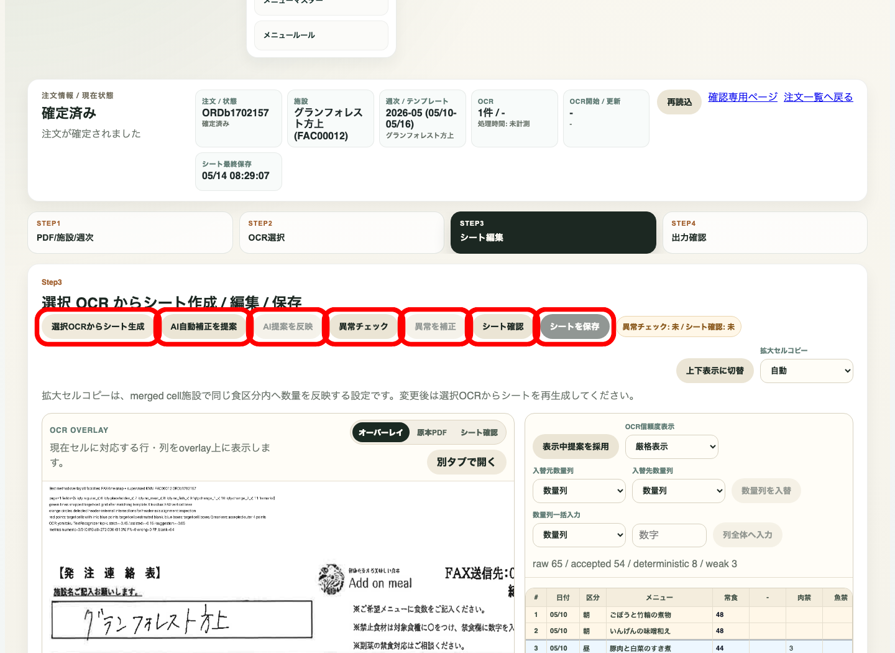</div>
  <div class="notes">
<ul>
<li>Step3は、選択OCRから作ったシートを編集し、出力に使う保存シートを作る画面です。</li>
<li><strong>シート確認</strong> と <strong>シートを保存</strong> は別操作です。確認だけでは保存されません。</li>
<li>シート確認済みでも、補正や列操作を行った後は再度確認し、保存が必要です。</li>
<li>画面右の状態表示で <strong>異常チェック</strong> と <strong>シート確認</strong> の状態を見ます。</li>
</ul>
  </div>
</div>

---

## 15. Step3の操作順序

<div class="split">
  <div class="shot"></div>
  <div class="notes">
<ol>
<li><strong>選択OCRからシート生成</strong> で編集対象シートを作ります。</li>
<li><strong>AI自動補正を提案</strong> で補正候補を作ります。</li>
<li>候補を見て、採用する場合は <strong>AI提案を反映</strong>、採用しない場合は反映せず手修正します。</li>
<li><strong>異常チェック</strong> を実行します。</li>
<li>必要なら <strong>異常を補正</strong> します。</li>
<li><strong>シート確認</strong> で見た目と数量を確認します。</li>
<li><strong>シートを保存</strong> を押します。</li>
</ol>
  </div>
</div>

---

## 16. OCR overlayとシート確認タブ

<div class="split">
  <div class="shot">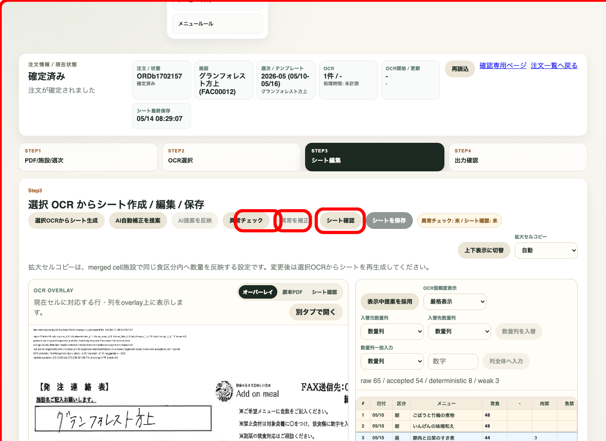</div>
  <div class="notes">
<ul>
<li><strong>オーバーレイ</strong>: 原本FAX画像の上にOCR候補とシート値を重ねて確認します。</li>
<li><strong>原本PDF</strong>: OCR overlayではなく原本を確認します。</li>
<li><strong>シート確認</strong>: 現在のシート値を対象セル右上に重ねて確認します。</li>
<li><strong>別タブで開く</strong> は、狭い画面で確認しづらいときに使います。</li>
</ul>
  </div>
</div>

---

## 17. シート本体を見ながら確認する

<div class="split">
  <div class="shot">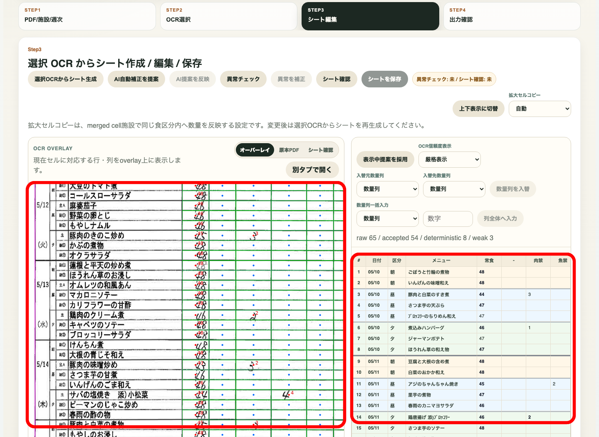</div>
  <div class="notes">
<ul>
<li>左側に原本FAX画像、右側にシート本体が表示されます。</li>
<li>右側の表で日付、区分、メニュー、数量列を確認します。</li>
<li>左右を見比べて、原本の数量がシートの同じ日付・同じ行に入っているか確認します。</li>
</ul>
  </div>
</div>

---

## 18. セルを押してOCR overlayの対応箇所を見る

<div class="split">
  <div class="shot">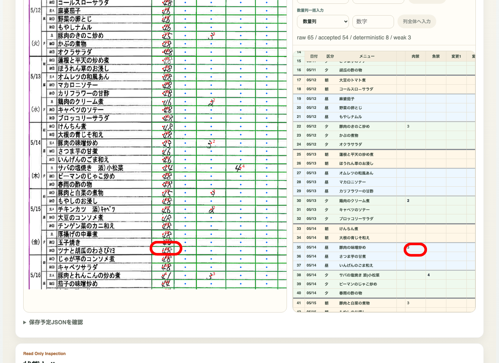</div>
  <div class="notes">
<ul>
<li>シート側の数量セルを押すと、原本FAX画像側の対応箇所を確認できます。</li>
<li>赤丸の例では、右のシートセルと左のFAX上の同じ数量を見比べます。</li>
<li>数字が一致しない場合は、シート側を修正してから再確認します。</li>
</ul>
  </div>
</div>

---

## 19. 数量列の入替と一括入力

<div class="split">
  <div class="shot">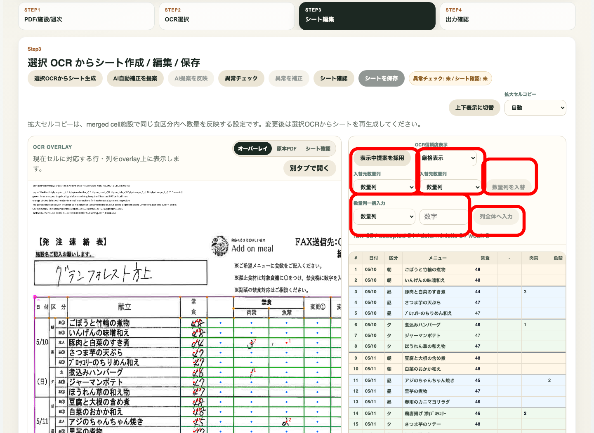</div>
  <div class="notes">
<ul>
<li><strong>入替元数量列</strong> と <strong>入替先数量列</strong> を選んで <strong>数量列を入替</strong> を押すと、列の対応を入れ替えます。</li>
<li>例: 常食に入るべき数量が肉禁列に入っている場合に使います。</li>
<li><strong>数量列一括入力</strong> は、対象数量列を選び、数字を入力して <strong>列全体へ入力</strong> を押します。</li>
<li>一括入力は広範囲に影響するため、実行後に必ずシート確認と異常チェックを行います。</li>
</ul>
  </div>
</div>

---

## 20. AI自動補正の採用/却下

<div class="split">
  <div class="shot">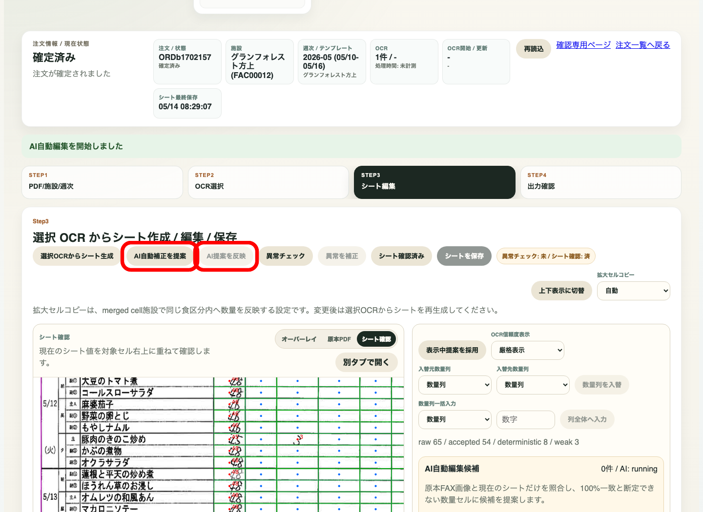</div>
  <div class="notes">
<ul>
<li><strong>AI自動補正を提案</strong> は、原本FAX画像と現在シートを照合して補正候補を作ります。</li>
<li>提案を採用する場合は、内容を確認して <strong>AI提案を反映</strong> を押します。</li>
<li>提案が不確実、または原本と合わない場合は採用せず、手修正します。</li>
<li>採用しても終わりではありません。採用後に異常チェック、シート確認、シート保存が必要です。</li>
</ul>
  </div>
</div>

---

## 21. 異常チェックと異常補正

<div class="split">
  <div class="shot">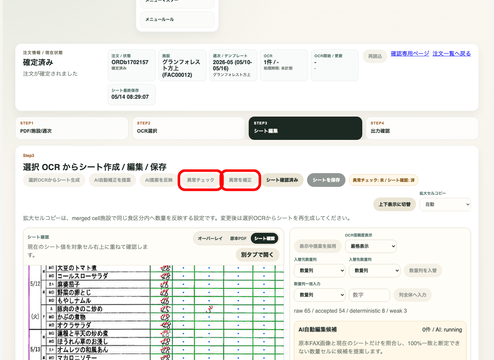</div>
  <div class="notes">
<ul>
<li><strong>異常チェック</strong> は、数量列、空欄、不自然な値、OCRとの不一致を確認するために実行します。</li>
<li>異常がある場合は <strong>異常を補正</strong>、またはセルを直接修正します。</li>
<li>異常補正後はもう一度 <strong>異常チェック</strong> を実行します。</li>
<li>異常チェックが未実行のまま出力確認へ進むと、誤った袋分けや納品書につながります。</li>
</ul>
  </div>
</div>

---

## 22. シート確認を行う

<div class="split">
  <div class="shot">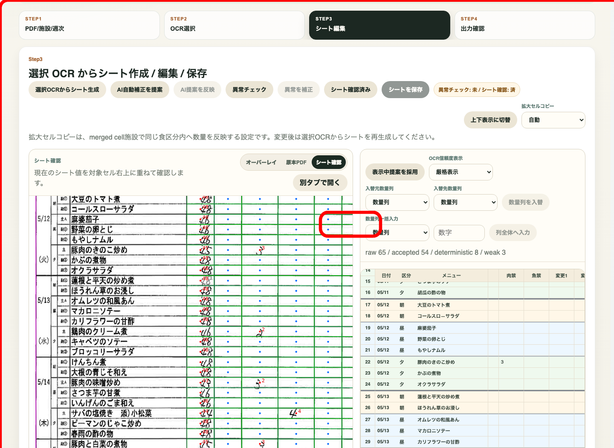</div>
  <div class="notes">
<ul>
<li><strong>シート確認</strong> を押して、現在のシート値を原本側に重ねて確認します。</li>
<li>ここで見ているのは保存前の確認です。</li>
<li>修正後に再確認しないと、古い確認状態のまま判断することになります。</li>
</ul>
  </div>
</div>

---

## 23. シートを保存する

<div class="split">
  <div class="shot">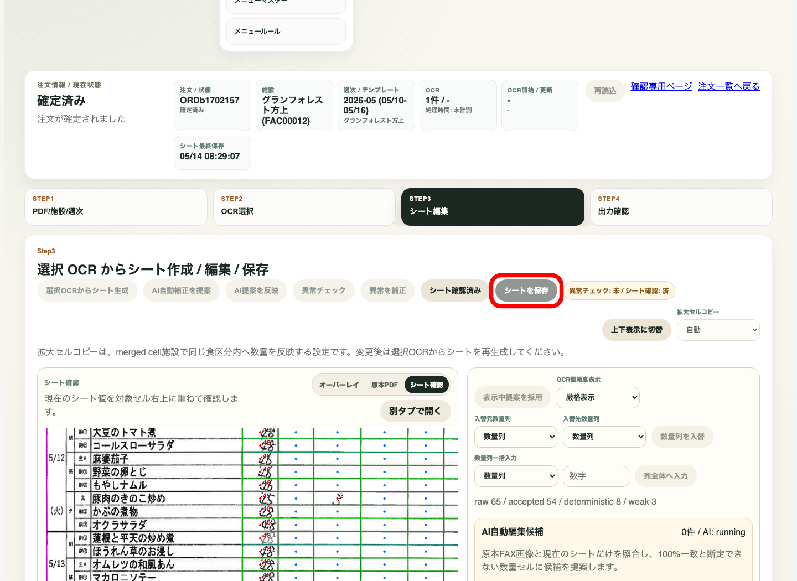</div>
  <div class="notes">
<ul>
<li><strong>シートを保存</strong> を押して、Step4の出力確認に使うシートを確定します。</li>
<li><strong>シート確認済み</strong> だけでは保存されません。</li>
<li>Step4へ進む前に、異常チェック済み、シート確認済み、シート保存済みを確認します。</li>
</ul>
  </div>
</div>

---

## 24. Step3で戻るべき分岐

<div class="split">
  <div class="shot"></div>
  <div class="notes">
<ul>
<li>OCR overlayとシート値が一致しない: セル修正、数量列入替、またはAI補正を使います。</li>
<li>数量列全体がずれている: 数量列入替を使います。</li>
<li>同じ列に同じ値を入れる必要がある: 数量列一括入力を使います。</li>
<li>AI提案が原本と違う: 採用せず手修正します。</li>
<li>異常チェックで残る: 異常補正または手修正後に再チェックします。</li>
<li>修正した: 必ずシート確認とシート保存をやり直します。</li>
</ul>
  </div>
</div>

---

## 25. Step4 出力確認へ移動する

<div class="split">
  <div class="shot">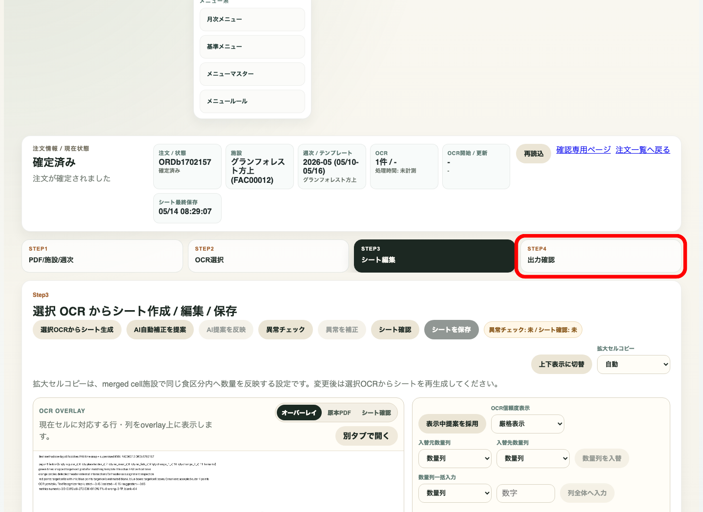</div>
  <div class="notes">
<ul>
<li><strong>STEP4 出力確認</strong> を押します。</li>
<li>袋分け、ラベル、納品書、総量の出力を確認する画面です。</li>
</ul>
  </div>
</div>

---

## 26. 出力を作成・確認する

<div class="split">
  <div class="shot">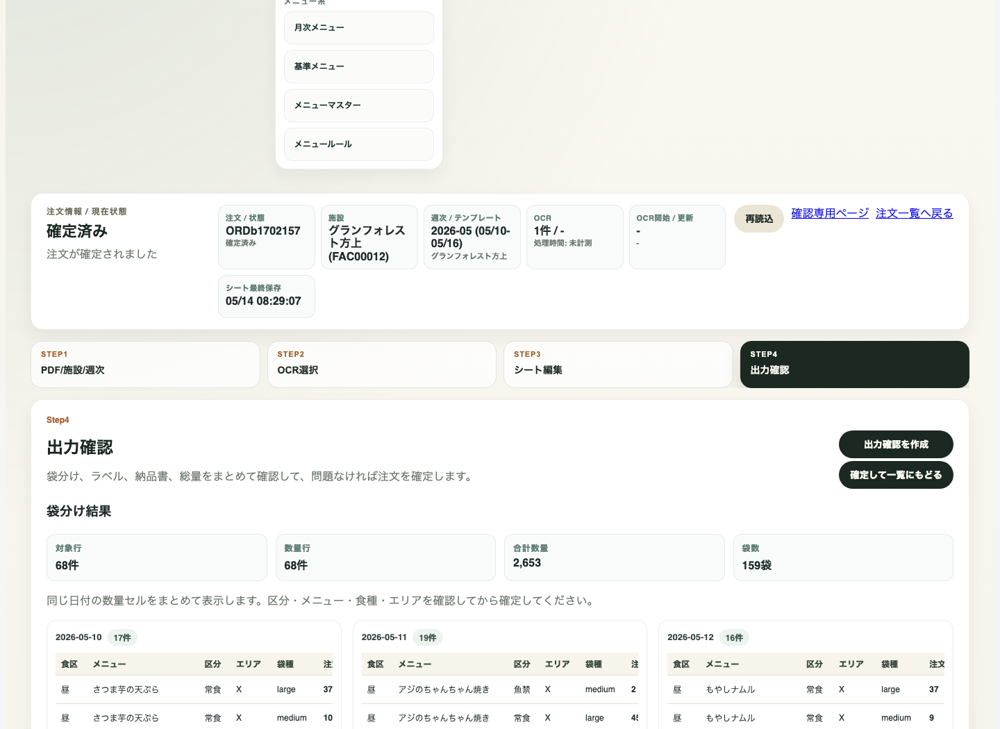</div>
  <div class="notes">
<ul>
<li><strong>出力確認を作成</strong> を押して、最新保存シートから出力確認を作ります。</li>
<li>袋分け結果、対象行、数量行、合計数量、袋数を確認します。</li>
<li>ラベル、納品書、総量はそれぞれ <strong>プレビュー</strong> と <strong>ダウンロード</strong> で確認します。</li>
</ul>
  </div>
</div>

---

## 27. 確定する

<div class="split">
  <div class="shot"></div>
  <div class="notes">
<ul>
<li>出力結果に問題がなければ <strong>確定して一覧にもどる</strong> を押します。</li>
<li>問題がある場合は確定せず、Step3へ戻ってシートを補正・保存し、Step4で出力確認を作り直します。</li>
<li>確定後は状態が <strong>確定済み</strong> になります。</li>
</ul>
  </div>
</div>

---

## 注意点まとめ

- 旧注文詳細画面ではなく、必ず `/workflow-v2` の画面で作業します。
- Step1の施設・週が正しくないままOCRを実行しません。
- シート編集後は **シートを保存** を押してからStep4へ進みます。
- Step4で出力を作り直した後に確定します。
- PDFや出力に違和感があれば、確定せずStep3またはStep1へ戻ります。
