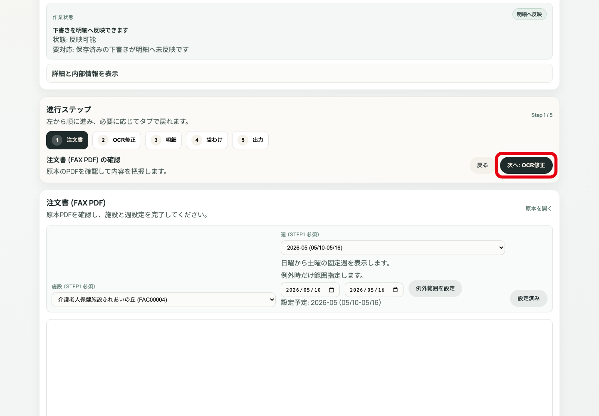

# 最短: 注文登録から確定まで

この資料は通常処理だけを最短で進める版。迷ったら詳細版を開く。

---

# 1. PDFを登録する

`注文書アップロードへ` → PDF選択 → 必要なら施設/週を指定 → アップロード。

例外:
- 施設/週が不明なら空欄登録後、注文詳細STEP1で確認。
- 重複時だけ強制登録を検討。

---

# 2. 注文一覧で対象を開く

検索欄で注文ID/施設/message_idを探し、対象行の `詳細` を押す。

見つからない場合は、状態フィルタとアーカイブ表示を確認。

---

# 3. STEP1 施設と週を確認

原本PDFを開き、施設と週が合っているか確認する。合っていれば `次へ: OCR修正`。

違う場合は施設/週を直してから進む。

---

# 4. STEP2 OCR/シートを確認

左の原本/OCRと右のシート数量を見比べる。正しければ `はい / 修正済み`、必要ならセルを直して `シートを保存（暫定）`。

OCRが出ない場合は再取得/再実行を判断。

---

# 5. STEP3 明細を確認

明細を開き、日付・食種・数量を確認する。おかしい行は開いて確認し、原因がOCRならSTEP2へ戻る。

問題なければ `次へ: 袋わけ`。

---

# 6. STEP4/5 出力して確定

袋わけを確認し、出力画面でラベル/納品書をダウンロードまたはプレビューする。すべて問題なければ確定状態を確認して注文一覧へ戻る。

---

# 最短判断表

- 施設/週が違う: STEP1へ戻る
- OCR/シート数量が違う: STEP2で修正
- 明細数量が違う: STEP3、必要ならSTEP2へ戻る
- 袋わけ/出力が違う: STEP4/5、必要ならSTEP3へ戻る
