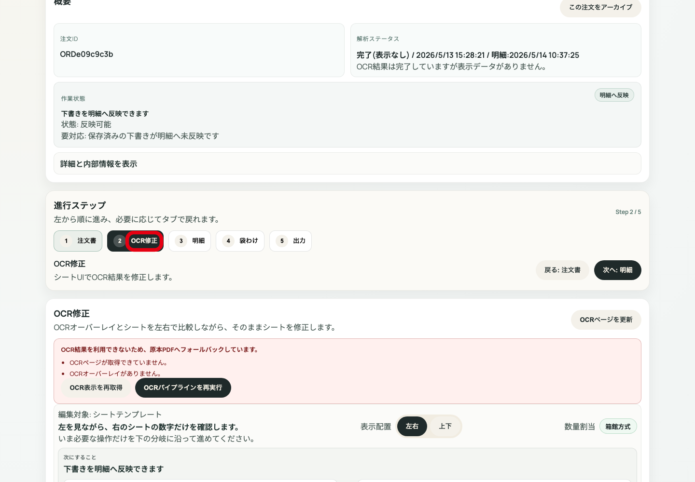
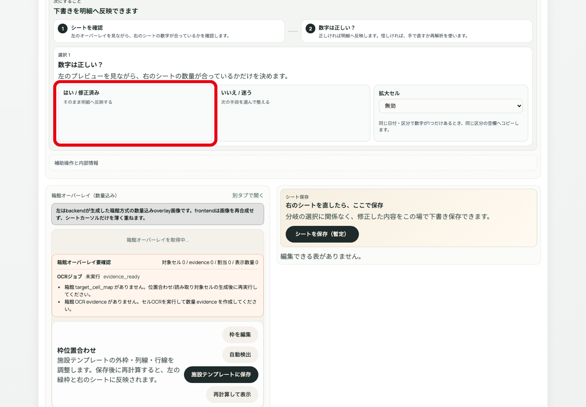
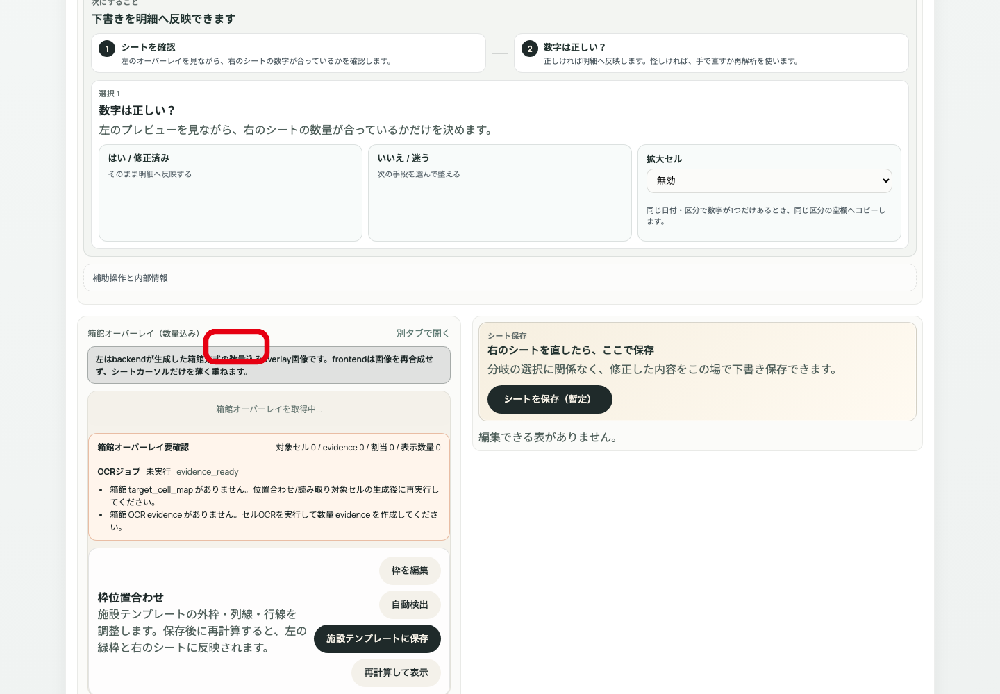
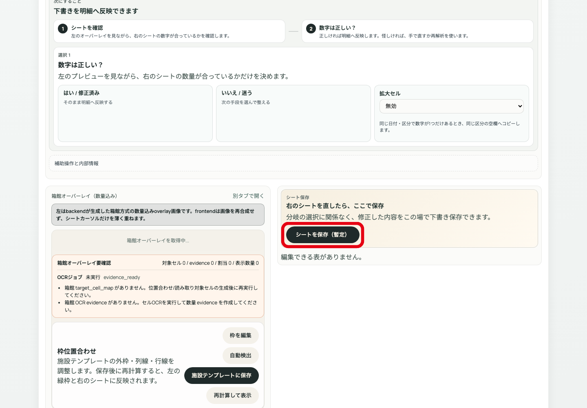
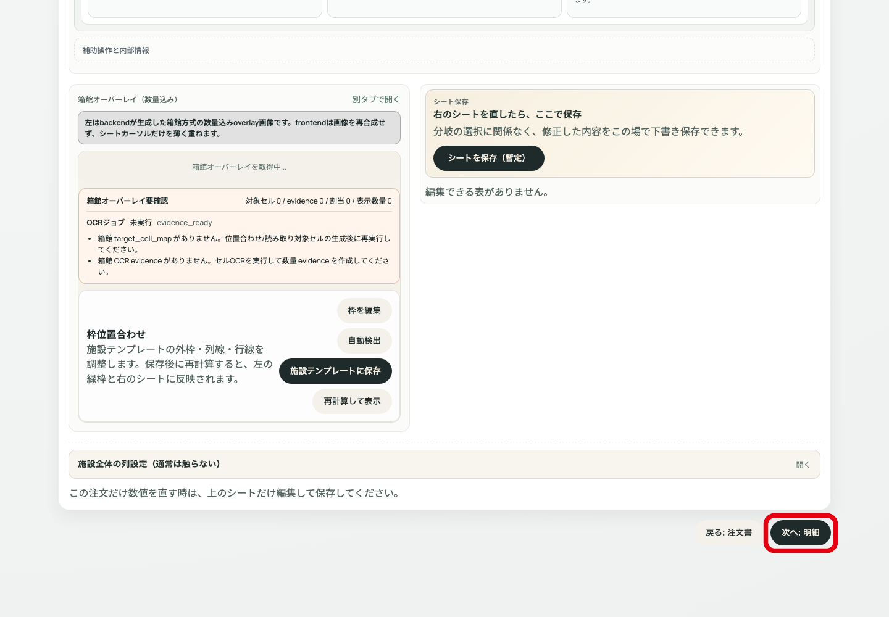

# シート操作マニュアル
## 注文詳細 STEP2 OCR修正

対象: 注文詳細の `OCR修正` / シート編集 / 下書き保存 / 明細反映

---

# シート操作の位置

注文詳細で `STEP2 OCR修正` を開く。
ここで左の原本/OCRと右のシートを見比べて、数量を確認・修正する。

この画面で行うこと:
- 数量が正しいか判断
- 必要ならシートの数字を修正
- 下書き保存
- 明細へ反映

---

# 1. 表示配置を選ぶ

操作: `左右` または `上下` を選ぶ。
使い分け:
- `左右`: 原本とシートを横並びで確認
- `上下`: 表を広く見たいとき

---

# 2. 数字が正しいか判断する

操作: `はい / 修正済み` または `いいえ / 迷う` を選ぶ。

分岐:
- 原本とシート数量が一致: `はい / 修正済み`
- 数量が違う、読めない、迷う: `いいえ / 迷う`

---

# 3. セルを直接修正する

操作: 修正対象のセルまたは入力欄を選び、原本どおりの数字にする。

注意:
- 修正するのは原則として数量
- 施設や週が違う場合は STEP1 に戻る
- 編集表が出ない場合は、OCR再取得/再実行を判断する

---

# 4. シートを保存する

操作: `シートを保存（暫定）` を押す。
使う場面: 数量を直したあと、明細へ反映する前。

分岐:
- 保存成功: 明細へ反映へ進む
- 保存不可: 編集表、OCR evidence、入力値を確認

---

# 5. OCR表示を再取得する

操作: `OCR表示を再取得` を押す。
使う場面:
- OCRページが表示されない
- オーバーレイがない
- 表示だけが古い可能性がある

---

# 6. OCRパイプラインを再実行する

操作: `OCRパイプラインを再実行` を押す。
使う場面: OCR結果そのものが崩れている場合。

注意: 副作用あり。対象注文IDと保存済み下書きの有無を確認してから実行する。

---

# 7. 明細へ反映する

操作: 上部の `明細へ反映` を押す。
使う場面: 保存済み下書きを注文の明細に反映する。

分岐:
- 下書きが正しい: 反映する
- 下書きに不安がある: 反映せずSTEP2で確認を続ける

---

# 8. 明細へ進む

操作: `次へ: 明細` を押す。
条件: シート数量の確認・修正・保存が終わっていること。

明細で数量違いに気づいたら、STEP2へ戻ってシートを直す。

---

# 例外対応

- 編集できる表がない: OCR表示再取得、OCR再実行、内部情報を確認
- 原本と施設が違う: STEP1で施設を直す
- 原本と対象週が違う: STEP1で週を直す
- シート保存できない: 入力値、OCR evidence、通信状態を確認
- 明細が変: STEP3からSTEP2へ戻って数量を直す

---

# 完了条件

- 原本/OCRとシート数量が一致している
- 必要な修正を保存している
- 下書きを明細へ反映している
- STEP3 明細で数量を再確認できる
