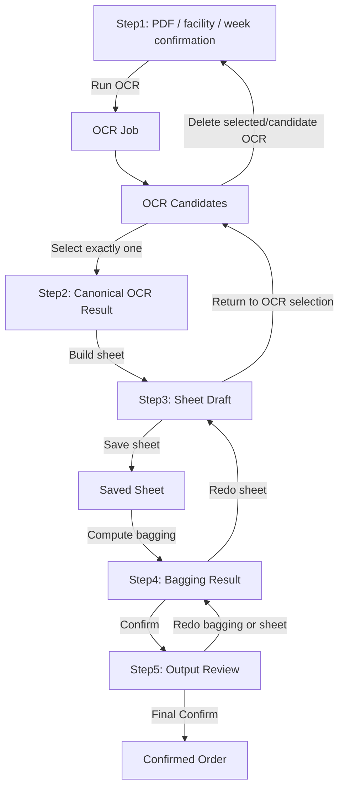

# Order Workflow State Machine Redesign 2026-05-02

## Purpose

注文処理の OCR からシート、袋分け、出力確認までを一から整理し直す。

今回の主目的は OCR 精度そのものではなく、注文の状態と成果物の正解を一つに固定し、保存した内容が別経路や古い fallback によって上書き・無視・再生成される問題を根本的に止めることである。

現在までに繰り返した問題は、個別のボタン不具合ではなく、状態管理と canonical source が複数存在することによる failure class である。

## Repeated Failure Classes

### 1. Split-Brain State

同じ注文に対して、以下の複数の状態が別々に存在し、画面・API・後段処理で参照元が一致していなかった。

- `draft-sheet`
- `ocr-sheet`
- `workflow-state`
- `OrderLine`
- OCR cache / evidence
- frontend local state
- saved revision
- confirmed lines

その結果、ユーザーがシートを保存しても、次に表示されるシートが保存結果ではなく OCR evidence や古い fallback から再構成されることがあった。

### 2. Current OCR And Candidate OCR Confusion

OCR 再実行結果が「候補」なのか「現在の正解」なのかが曖昧だった。

再実行した OCR が current draft を自動で上書きしたり、逆に candidate だけ更新されて画面は古い current のまま残ったりした。

### 3. Legacy Fallback Leakage

古い `OrderLine`、confirmed lines、raw OCR、cache、draft revision が fallback として残り、現行の正解状態を持っていない場合に暗黙に採用される経路があった。

これは安全弁ではなく、誤ったデータを正解として画面に出す経路になっていた。

### 4. Save And Apply Responsibility Mix

「シートを保存する」「明細に反映する」「次の step に進める」「注文を確定する」が同じ UI/状態で混在していた。

そのため、下書き保存が成功しても workflow が進まない、または workflow だけ進んで実データが保存されていないように見える問題が起きた。

### 5. Read-Only Inspection Triggers Mutation

OCR や PDF、袋分け結果を確認するだけの操作が、step 再実行・draft 再構成・cache 再取得などの副作用を持つ経路に乗っていた。

確認のために画面を開いただけで状態が変わる、または重い処理が同期的に走る可能性があった。

### 6. Page Navigation As Workflow State

現在の進行 step が URL、frontend state、backend state のどれで決まるのかが曖昧だった。

ページ遷移や reload によって、ユーザーが意図していない step に戻る・進む・古い結果を表示する問題につながった。

## New Principle

注文ごとに DB 上で workflow state を一つだけ持つ。

各 step は明示的な確定操作でのみ次へ進む。画面表示や reload は状態を変更しない。

各成果物は immutable artifact として保存し、次 step は直前 step で確定された artifact ID だけを入力にする。

## Required Workflow

### Step1: PDF And Order Context Confirmation

目的は、OCR 実行前に処理対象の前提を確定すること。

ユーザーが確認するもの:

- 原本 PDF
- 施設
- 対象週
- 使用する施設テンプレートまたはテンプレート生成条件

許可される操作:

- 施設と週次を確定する
- OCR を実行する
- Step2 から戻って OCR をやり直す
- LLM に施設/週次候補を推論させる

禁止される操作:

- 未確定の施設/週次で OCR 結果を正解化する
- template が未解決のまま sheet を生成する
- 古い OCR cache を current として採用する

### Step2: OCR Result Selection

目的は、複数存在しうる OCR 結果の中から、ただ一つの canonical OCR result を選ぶこと。

ユーザーが確認するもの:

- OCR overlay
- OCR evidence
- OCR 結果から作られる候補 sheet preview
- 複数候補がある場合は横並び比較

許可される操作:

- OCR result を一つ選ぶ
- OCR result を削除する
- OCR をやり直すため Step1 に戻る

削除ルール:

- canonical OCR を削除する場合、その OCR から派生した sheet draft、saved sheet、bagging result、output artifacts はすべて削除する。
- 削除後は Step1 からやり直す。
- archive ではなく、検証上は完全削除として扱う。

禁止される操作:

- OCR 候補を選ばずに Step3 へ進む
- candidate OCR を current と混同する
- legacy fallback の OCR を暗黙に current にする

### Step3: Sheet Edit And Save

目的は、選ばれた canonical OCR result からシートを作り、ユーザーが編集・保存すること。

ユーザーができること:

- シート編集
- シート保存

Step3 でやらないこと:

- OCR 再実行
- OCR 候補選択
- 袋分け
- 注文確定
- 明細反映という別概念の apply

保存された sheet は Step4 の唯一の入力になる。

### Step4: Bagging / Aggregation Confirmation

目的は、保存済み sheet だけを入力にして総量・袋分けを計算し、ユーザーに確認させること。

入力:

- Step3 で保存された `saved_sheet_id`

出力:

- `bagging_result_id`
- aggregate outputs
- delivery / labels / related output drafts

禁止される操作:

- OCR evidence から袋分けを直接作る
- 未保存 sheet から袋分けを作る
- 古い OrderLine fallback を使う

### Step5: Output Review And Final Confirm

目的は、出力成果物を確認し、明示的な確定操作で注文を final confirmed にすること。

確定ボタンが押されない限り、注文は確定しない。

許可される操作:

- 出力確認
- 確定
- Step4 または Step3 へ戻ってやり直す

禁止される操作:

- 画面を開いただけで確定する
- Step5 に到達しただけで確定扱いにする
- confirm 失敗時に一部だけ確定する

## Read-Only Inspection Page

step とは別に、確認専用ページを作る。

表示対象:

- 原本 PDF
- OCR candidates
- selected canonical OCR
- overlay
- selected OCR evidence
- saved sheet
- bagging result
- workflow state
- artifact lineage

このページは副作用を持たない。開いても OCR 再実行、draft 再構成、bagging 再計算、状態遷移を行わない。

## Canonical Data Model

### OrderWorkflowState

注文の現在状態を一つだけ表す。

主要フィールド:

- `order_id`
- `state`
- `facility_id`
- `week_start`
- `week_end`
- `template_id`
- `selected_ocr_result_id`
- `saved_sheet_id`
- `bagging_result_id`
- `output_bundle_id`
- `revision`
- `updated_by`
- `updated_at`

想定 state:

- `uploaded`
- `context_confirmed`
- `ocr_running`
- `ocr_selection_required`
- `ocr_selected`
- `sheet_editing`
- `sheet_saved`
- `bagging_ready`
- `bagging_confirmed`
- `output_review`
- `confirmed`
- `blocked`

### OcrResult

OCR 実行一回分の immutable artifact。

主要フィールド:

- `ocr_result_id`
- `order_id`
- `job_id`
- `facility_id`
- `week_start`
- `week_end`
- `template_id`
- `pipeline_version`
- `status`
- `overlay_artifact_id`
- `evidence_artifact_id`
- `candidate_sheet_preview_artifact_id`
- `created_at`

### SavedSheet

ユーザーが Step3 で保存したシートの immutable revision。

主要フィールド:

- `saved_sheet_id`
- `order_id`
- `source_ocr_result_id`
- `rows_json`
- `revision`
- `saved_by`
- `saved_at`

### BaggingResult

Step4 の計算結果。

主要フィールド:

- `bagging_result_id`
- `order_id`
- `source_saved_sheet_id`
- `summary_json`
- `artifacts_json`
- `created_at`

## Invariants

1. Step3 は `selected_ocr_result_id` がない場合に開始できない。
2. Step4 は `saved_sheet_id` がない場合に開始できない。
3. Step5 は `bagging_result_id` がない場合に開始できない。
4. `selected_ocr_result_id` を変更または削除した場合、その downstream artifacts は削除される。
5. `saved_sheet_id` を変更または削除した場合、bagging/output artifacts は削除される。
6. inspection page は状態遷移しない。
7. frontend state は workflow state の表示キャッシュであり、正解ではない。
8. OCR cache は artifact 保存の補助であり、current truth ではない。
9. `OrderLine` は final confirm 後の出力・履歴用であり、Step2/Step3 の fallback source ではない。
10. legacy fallback で current sheet を作る経路は削除または明示 blocker に変換する。

## Implementation Plan

### Phase 0: Freeze And Map Current Paths

目的:

- 既存の read/write path を列挙し、削除対象と移行対象を分ける。

作業:

- `orders/[id]` が参照する API を列挙する。
- `draft-sheet`, `ocr-sheet`, `workflow-state`, order detail payload の source を列挙する。
- `OrderLine` fallback を使う箇所を列挙する。
- OCR cache / evidence / revision / current draft の関係を列挙する。

成果物:

- 削除する旧経路リスト
- 新 state machine に残す endpoint リスト

#### Current Backend Entry Points To Replace

現行の注文詳細フローに関係する主な endpoint は以下である。

- `GET /orders/{order_id}/draft-sheet`
- `POST /orders/{order_id}/draft-sheet`
- `POST /orders/{order_id}/draft-sheet/switch-evidence`
- `POST /orders/{order_id}/draft-sheet/keep-current`
- `GET /orders/{order_id}/draft-sheet/candidate-preview`
- `POST /orders/{order_id}/draft-sheet/force-weekly-menu`
- `POST /orders/{order_id}/draft-sheet/force-facility-schema`
- `POST /orders/{order_id}/draft-sheet/apply-patch-candidate`
- `GET /orders/{order_id}/workflow-state`
- `GET /orders/{order_id}/ocr-pages`
- `GET /orders/{order_id}/ocr-sheet`
- `POST /orders/{order_id}/ocr-apply`
- `POST /orders/{order_id}/ocr-sheet-save`
- `POST /orders/{order_id}/confirm`
- `POST /orders/{order_id}/reparse`
- `POST /orders/{order_id}/ocr-rerun`

これらは互換 endpoint として段階的に残す場合でも、新 workflow の正解状態を作る経路としては使わない。新 UI は新 API のみを使用する。

#### Current Backend Services To Split

現行では `order_service.py` が次の責務を持ちすぎている。

- OCR 実行
- OCR evidence 保存
- current sheet 構築
- draft 保存
- patch candidate 適用
- apply to order lines
- confirm
- output enqueue
- facility/week change recovery
- fallback reconstruction

新方式では以下に分ける。

- `order_workflow_state_machine_service.py`: step 遷移だけを担当する。
- `order_ocr_result_service.py`: OCR job/result/candidate/current selection を担当する。
- `order_sheet_workspace_service.py`: selected OCR から sheet を作り、保存済み sheet を管理する。
- `order_bagging_workflow_service.py`: saved sheet から袋分け結果を作る。
- `order_output_review_service.py`: output review と final confirm を担当する。
- `order_inspection_service.py`: read-only inspection payload を返す。

#### Current Frontend Entry Point To Replace

現行の `frontend/src/pages/orders/[id].tsx` は一画面に以下を同居させている。

- Step1 施設/週次選択
- Step2 OCR 結果確認
- OCR 再実行
- OCR overlay 表示
- sheet edit
- sheet save
- apply to details
- confirm
- facility template edit
- candidate/current evidence handling
- workflow summary

新方式では、このページを workflow projection renderer として作り直す。各 step の mutation は新 endpoint に限定する。

#### Current Data Models And Reuse Decision

既存 model の扱い:

- `Order`: 継続利用する。注文の親レコード。
- `OrderLine`: final confirm 後の出力・履歴用に限定する。Step2/Step3 の fallback source としては使わない。
- `OrderWorkflowState`: 拡張または置換する。現行の `evidence_run_id`, `draft_id`, `confirmed_snapshot_id` だけでは新 state machine の lineage が不足する。
- `OrderOcrEvidenceRun`: OCR result artifact として再利用可能。ただし current/candidate selection は別テーブルまたは workflow state で明示する。
- `OrderSheetDraft`: Step3 の saved sheet として再利用可能。ただし `draft` という名前と current draft 自動再構成の意味は整理する。
- `OrderOcrCache`: truth ではなく cache。新 workflow の current 判定には使わない。

#### First Implementation Cut

最初の実装 cut は既存 UI を直接大改造する前に、backend に新 workflow の安全な骨格を追加する。

1. 新 state machine service を追加する。
2. 既存 `OrderWorkflowState` に不足する lineage を JSON payload として持たせるか、専用 model を追加する。
3. 新 read-only `GET /orders/{id}/workflow-v2` を追加する。
4. Step1 context confirm の endpoint を追加する。
5. OCR result list/select/delete の endpoint を追加する。
6. Sheet save/read の endpoint を追加する。
7. 旧 endpoint にはまだ手を入れず、新 endpoint のテストを先に固定する。

この cut では既存画面の挙動は変えない。新 API と state transition の不変条件を先にテストで固定する。

#### Implemented First Cut

2026-05-02 時点で追加したもの:

- `backend/src/services/order_workflow_v2_service.py`
- `GET /orders/{id}/workflow-v2`
- `POST /orders/{id}/workflow-v2/context`
- `POST /orders/{id}/workflow-v2/ocr-runs`
- `GET /orders/{id}/workflow-v2/ocr-results`
- `POST /orders/{id}/workflow-v2/ocr-results/{ocr_result_id}/select`
- `DELETE /orders/{id}/workflow-v2/ocr-results/{ocr_result_id}`
- `GET /orders/{id}/workflow-v2/sheet-source`
- `GET /orders/{id}/workflow-v2/sheet`
- `PUT /orders/{id}/workflow-v2/sheet`
- `GET /orders/{id}/workflow-v2/inspection`
- `POST /orders/{id}/workflow-v2/bagging`
- `POST /orders/{id}/workflow-v2/bagging/confirm`
- `POST /orders/{id}/workflow-v2/outputs/review`
- `POST /orders/{id}/workflow-v2/confirm`
- `backend/tests/unit/test_order_workflow_v2_service.py`

この first cut の性質:

- 旧 `workflow-state` / `critical-decisions` / `draft-sheet` / `ocr-sheet` / `ocr-pages` / `ocr-apply` / `confirm` 系 endpoint は workflow-v2 移行済みとして HTTP 410 を返す。
- 旧 endpoint は状態再生成、fallback 表示、重い overlay 生成を実行しない。
- `OrderLine` fallback は新 workflow-v2 sheet read path では使わない。
- OCR result selection は `OrderOcrEvidenceRun` を明示的に選択する。
- selected OCR を変更または削除すると、派生 sheet draft と confirmed snapshot は削除される。
- Step1 の OCR 実行は `/workflow-v2/ocr-runs` から行い、旧 `workflow-state` refresh を返さず、workflow-v2 状態だけを `ocr_running` に更新する。
- Context 確定時は `Order.facility_code` と `Order.week_code` も更新し、OCR pipeline が workflow-v2 で確定した施設・週次を見るようにする。
- Step3 の sheet source は、選択済み `OrderOcrEvidenceRun.payload_json` だけをHakodate投影に使う。latest evidence や cache は読まない。
- frontend の Step3 は JSON textarea ではなく、生成された `fields/header/rows` を編集表として表示し、その内容を保存する。
- sheet は selected OCR がないと保存できない。
- inspection は workflow / OCR results / saved sheet / artifact lineage の read-only projection を返す。
- Step4 は saved sheet だけを入力に workflow-v2 bagging artifact を作る。
- Step4 は saved sheet から materialization candidate を作り、materialize 不能なら blocker として停止する。
- Step5 は output review artifact がある場合だけ final confirm し、同じ materialization candidate を `OrderLine` に反映してから workflow-v2 confirmed snapshot を保存する。
- `OrderLine` は Step5 final confirm で初めて更新する。Step2/Step3 の current sheet source や fallback source には使わない。
- frontend に `/orders/{id}/workflow-v2` を追加した。この画面は `workflow-v2` API だけを呼び、旧 `draft-sheet` / `ocr-sheet` / `ocr-apply` / `confirm` を呼ばない。
- frontend に `/orders/{id}/inspection-v2` を追加した。この画面は原本 PDF と `/workflow-v2/inspection` を read-only で表示し、step 遷移 API を呼ばない。
- 既存注文詳細には `新ワークフローで開く` リンクを追加した。旧詳細画面から旧 workflow endpoint を呼ぶと 410 で停止する。
- 注文一覧の `詳細` は `/orders/{id}/workflow-v2` を指すように変更した。旧画面は `旧詳細` として明示的に分離した。

検証:

- `uv run --extra dev pytest tests/unit/test_order_workflow_v2_service.py -q`
- 結果: 12 passed。
- `python -m py_compile backend/src/services/order_workflow_v2_service.py backend/src/api/orders.py`
- 結果: passed。
- `npx tsc --noEmit --pretty false`
- 結果: passed。

### Phase 1: DB Schema And Service Boundary

目的:

- workflow state と artifact lineage を DB 上で一意に管理する。

作業:

- `order_workflow_states` を新 state machine 用に整理する。
- `order_ocr_results` を canonical OCR candidate/result として定義する。
- `order_saved_sheets` を Step3 保存の唯一の source とする。
- `order_bagging_results` を Step4 出力の source とする。
- downstream cascade delete を service transaction に入れる。

### Phase 2: Backend API Redesign

目的:

- step ごとに API の責務を分離する。

新 API 案:

- `GET /orders/{id}/workflow`
- `POST /orders/{id}/step1/confirm-context`
- `POST /orders/{id}/ocr-runs`
- `GET /orders/{id}/ocr-results`
- `POST /orders/{id}/ocr-results/{ocr_result_id}/select`
- `DELETE /orders/{id}/ocr-results/{ocr_result_id}`
- `GET /orders/{id}/sheet`
- `PUT /orders/{id}/sheet`
- `POST /orders/{id}/bagging`
- `POST /orders/{id}/bagging/{bagging_result_id}/confirm`
- `GET /orders/{id}/outputs`
- `POST /orders/{id}/confirm`
- `GET /orders/{id}/inspection`

削除または compatibility blocker 化する API:

- current/candidate を曖昧に返す old `draft-sheet`
- old `ocr-sheet` fallback path
- OrderLine から current sheet を再構成する path
- cache miss 時に raw OCR で表示継続する path

### Phase 3: Frontend Step UI Rebuild

目的:

- UI を DB workflow state の projection にする。

作業:

- Step1 画面: PDF/context confirm/OCR run。
- Step2 画面: OCR candidates を比較し、ただ一つ選ぶ。
- Step3 画面: selected OCR 由来の sheet を編集・保存。
- Step4 画面: saved sheet 由来の bagging を確認。
- Step5 画面: output review と final confirm。
- Inspection page: read-only。

禁止:

- frontend local state だけで step を進める。
- 表示用 API 呼び出しで mutation を発生させる。

### Phase 4: Stg Reset And Migration

目的:

- stg の注文状態を clean にして、新 workflow で検証できる状態にする。

作業:

- 5/1-5/2 の注文 PDF をローカルへ退避する。
- stg の注文、OCR cache、OCR artifacts、sheet drafts、bagging artifacts、workflow state を削除する。
- menu / facility / template master は残す。
- 新規アップロードから 14 施設の処理を行う。

### Phase 5: Remove Legacy Paths

目的:

- 旧 fallback が再発しないようにする。

作業:

- OrderLine fallback を Step2/Step3 から削除する。
- `draft_newer_than_lines` のような中間警告で current truth を切り替える設計をやめる。
- cache fallback を blocker に変換する。
- current/candidate ambiguity を API schema から消す。

## Test Plan

### Unit Tests

- state transition が許可された順序でのみ進む。
- selected OCR 削除で downstream artifacts が削除される。
- saved sheet 削除または更新で bagging/output が無効化される。
- Step4 は saved sheet なしでは実行できない。
- Step5 は bagging result なしでは confirm できない。
- inspection endpoint は mutation しない。

### Integration Tests

- upload -> Step1 confirm -> OCR run -> Step2 select -> Step3 save -> Step4 bagging -> Step5 confirm が通る。
- OCR result が複数ある場合、選択された一つだけが Step3 に使われる。
- OCR result 削除後に Step3/Step4/Step5 artifacts が残らない。
- saved sheet を保存後、reload しても同じ saved sheet が表示される。
- old `OrderLine` が存在しても Step3 sheet には使われない。
- OCR cache が存在しても selected OCR でなければ current truth にならない。

### UI Tests

- Step1 で施設/週次未確定なら OCR 実行できない。
- Step2 で OCR 未選択なら Step3 に進めない。
- Step3 で保存した値が reload 後も残る。
- Step4 は保存済み sheet の値だけで計算される。
- Step5 は confirm ボタンを押すまで confirmed にならない。
- inspection page を開いても workflow state が変わらない。

### Stg Verification

- stg の注文を clean にした後、14 施設 PDF を新規アップロードする。
- 各注文で OCR job が止まらず完走する。
- 各注文で Step2 overlay が表示される。
- 各注文で Step3 sheet が selected OCR と一致する。
- 各注文で Step3 保存後の reload で保存値が残る。
- 各注文で Step4 bagging が saved sheet から生成される。
- 各注文で Step5 confirm まで進む。
- 確認専用ページで各 artifact lineage が見える。

## Impact On Existing Stg Data

stg の注文関連データは一旦破棄対象にする。

破棄対象:

- orders
- order lines
- OCR jobs
- OCR caches
- OCR evidence/artifacts
- draft sheets
- saved sheet revisions
- workflow states
- bagging/output artifacts

保持対象:

- facilities
- facility templates
- menus
- menu master
- user/auth config
- system configuration unrelated to orders

事前退避:

- 5/1-5/2 の注文 PDF はローカルにダウンロードして保存する。

## What This Solves

この設計は、これまで別チャットを含めて繰り返した以下の問題を根本的に解消する。

- 保存したシートが次回表示で無視される。
- OCR 再実行結果が current なのか candidate なのか分からない。
- 古い cache や OrderLine fallback が current sheet に混ざる。
- workflow-state と draft-sheet が矛盾する。
- 下書き保存、明細反映、確定が同じ概念として混ざる。
- 確認のために画面を開くと処理が再実行される。
- 複数 OCR 結果のうち、どれが正解か分からない。
- 削除した OCR の派生成果物が残る。
- Step5 にいるだけで確定済みのように見える。

ただし、この設計だけでは OCR 認識精度やテンプレート位置合わせ精度そのものは解決しない。それらは Step2 の OCR result quality として扱い、選択・削除・再実行できる状態にする。

## Non-Negotiable Design Rules

- 正解 OCR は一つだけ。
- 正解 sheet は Step3 で保存された sheet 一つだけ。
- 後段処理は saved sheet だけを見る。
- 表示だけの fallback は禁止。
- inspection は read-only。
- legacy fallback は削除する。安全弁が必要な場合は blocker として設計し直す。
- state transition は DB transaction で行う。
- ページ遷移は state ではない。
- cache は truth ではない。
- current/candidate ambiguity を API に残さない。
