# Sawa Hospital System ユーザー向けマニュアル（詳細版ドラフト）

作成日: 2026-01-21  
対象: オペレーター / 管理者

---

## 0. このマニュアルの使い方
- まずは **「日常運用（毎日やること）」** を読んでください。
- 操作に迷ったら **「画面別の手順」** と **「よくある質問」** を参照してください。
- 画面スクショは `workspace/docs/user_manual_screenshots/` に置き、本文のファイル名と一致させてください。

---

## 1. 概要
本システムは、FAXで届いた注文書PDFを自動で取り込み、OCRで読み取り、明細・袋分け・出力（ラベルCSV／納品書Excel／総量CSV）までを一連で処理する業務システムです。

### 1.1 主な業務フロー
1. FAX受信 → 注文自動登録
2. 注文詳細でOCR実行／結果確認
3. 明細確認・必要なら修正
4. 袋分け結果確認
5. 出力ファイルをダウンロード

> **スクショ**: ダッシュボード  
> 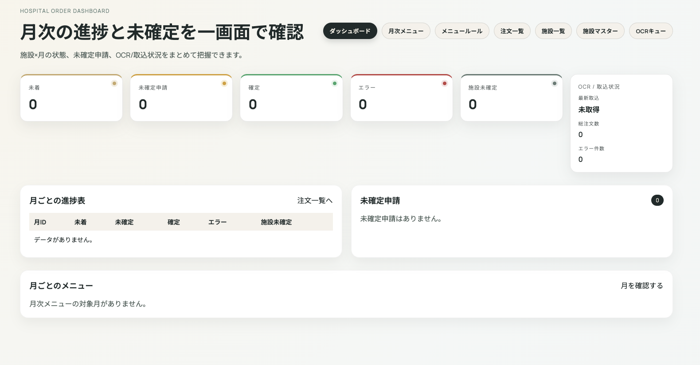

---

## 2. 日常運用（毎日やること）
### 2.1 朝のチェック
1. **注文一覧**を開く
2. 新着注文があるか確認
3. OCRステータスが「失敗/停止」になっていないか確認

> **スクショ**: 注文一覧  
> 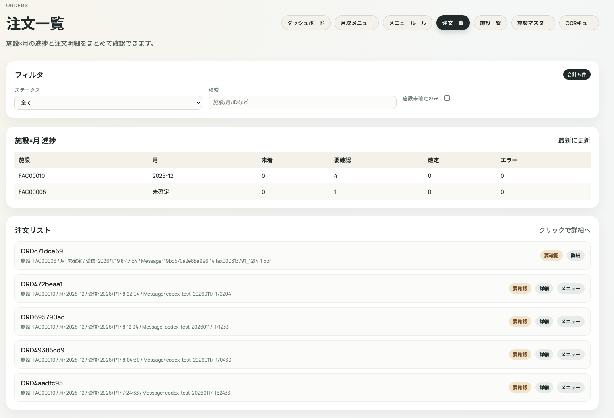

### 2.2 注文の処理（1件ずつ）
1. 注文一覧から対象の注文をクリック
2. 原本PDFを確認
3. OCR結果を確認 → 必要なら修正
4. 明細確認
5. 袋分け結果確認
6. 出力をダウンロード

### 2.3 夕方の確認
- OCR失敗が残っていないか再確認
- 出力漏れがないか確認

---

## 3. ログイン
- Googleログインでシステムにアクセスします。

> **スクショ**: ログイン画面  
> 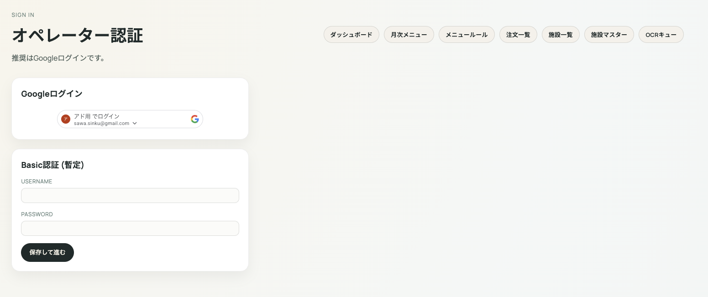

**よくある詰まり**
- ログインできない → 「11. トラブルシューティング」を参照

---

## 4. 画面構成（クイックリンク）
左上のクイックリンクから主要機能に移動できます。

- Dashboard
- Orders（注文一覧）
- 施設一覧
- 月次メニュー
- メニュールール
- OCR Queue（OCR処理状況）

> **スクショ**: クイックリンク  
> 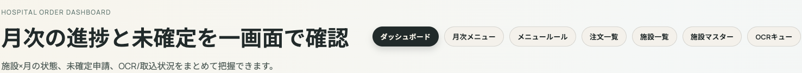

---

## 5. 注文一覧（Orders）
### 5.1 表示内容
- 注文ID
- 受信日時
- OCRステータス
- 施設名（推定含む）

### 5.2 操作
- **注文をクリック** → 注文詳細へ

**よくある詰まり**
- 注文が一覧に出ない → OCR Queue を確認
- OCRステータスがずっと「実行中」→ 注文詳細で再実行

---

## 6. 注文詳細（ステップ式）
注文詳細は、上部のステップで順番に進めます。

### 6.1 原本PDFの確認
**操作**
1. 注文詳細を開く
2. 左側の原本PDFを確認

> **スクショ**: 原本PDF  
> 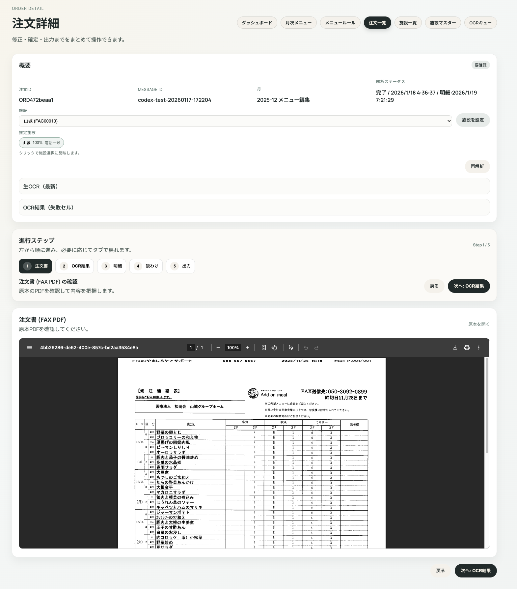

**詰まりポイント**
- PDFが表示されない → 再読込してもダメなら管理者へ

---

### 6.2 OCRステータスの確認・実行
**操作**
- ステータスが「未実行」「失敗」「停止」の場合は **再解析** ボタンを押す

> **スクショ**: OCRステータス  
> 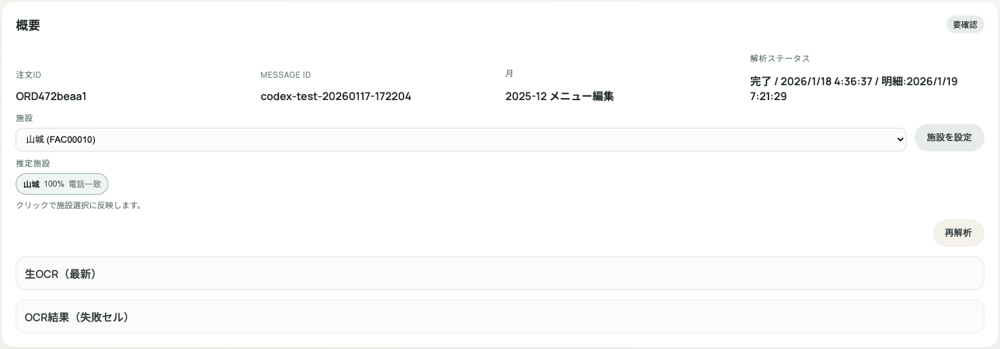

**詰まりポイント**
- 「実行中」のまま進まない → 数分待つ → それでも変わらない場合は管理者へ

---

### 6.3 OCR結果（読み取り結果）の確認
**操作**
- 読み取り結果の先頭10行を確認
- 必要なら **修正する** を押す

> **スクショ**: OCR結果  
> 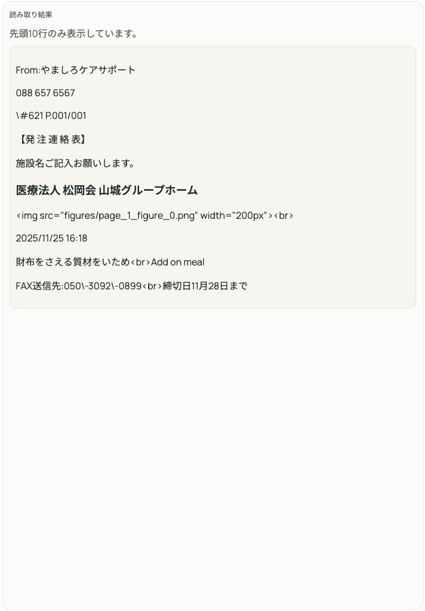

**詰まりポイント**
- 文字化けや空欄が多い → OCR修正へ進む

---

### 6.4 OCR修正（オーバーレイ編集）
**操作**
1. 「修正する」を押す
2. オーバーレイ上のセルをクリックして修正
3. 必要ならレイアウト調整

> **スクショ**: OCRオーバーレイ編集  
> 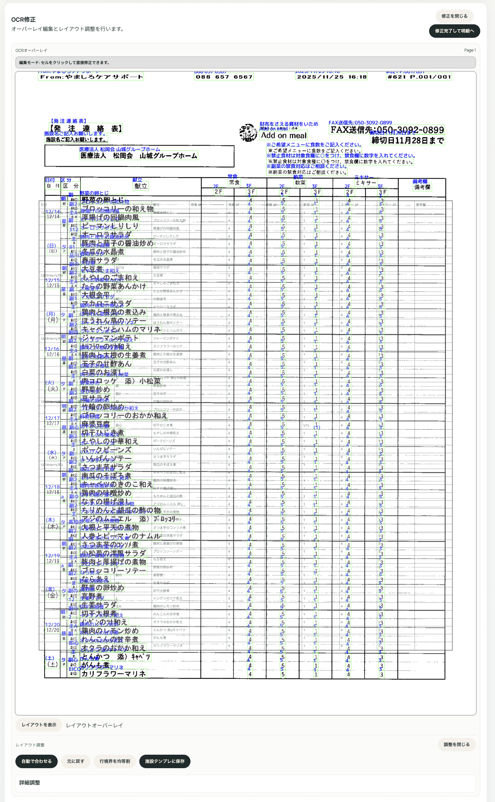

#### レイアウト調整
**操作**
- 「自動で合わせる」を押す
- ずれが残る場合は微調整

> **スクショ**: レイアウト調整  
> 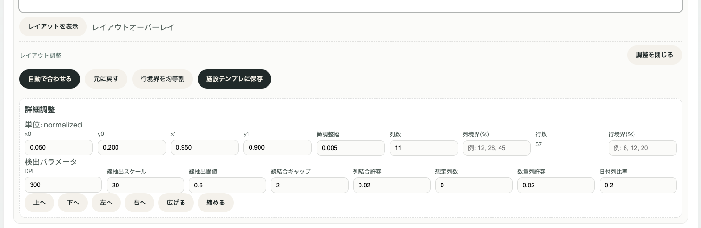

**詰まりポイント**
- 表の罫線が合わない → 自動調整 → 手動微調整

---

### 6.5 明細確認
**操作**
- 明細表を確認し、空欄・誤りがないか見る

> **スクショ**: 明細  
> 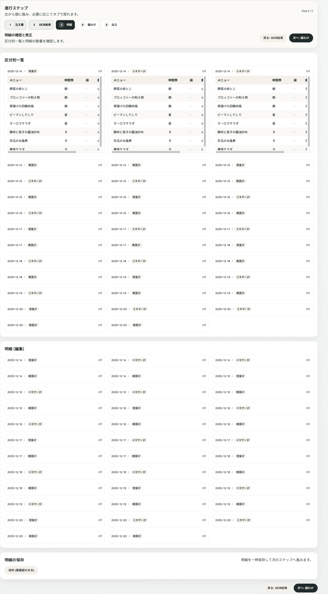

**詰まりポイント**
- 明細が空 → OCR結果の反映を再実行

---

### 6.6 袋分け結果確認
**操作**
- 施設区分ごとに数量が正しいか確認
- 修正した場合は **袋分け再計算** を押す

> **スクショ**: 袋分け結果  
> 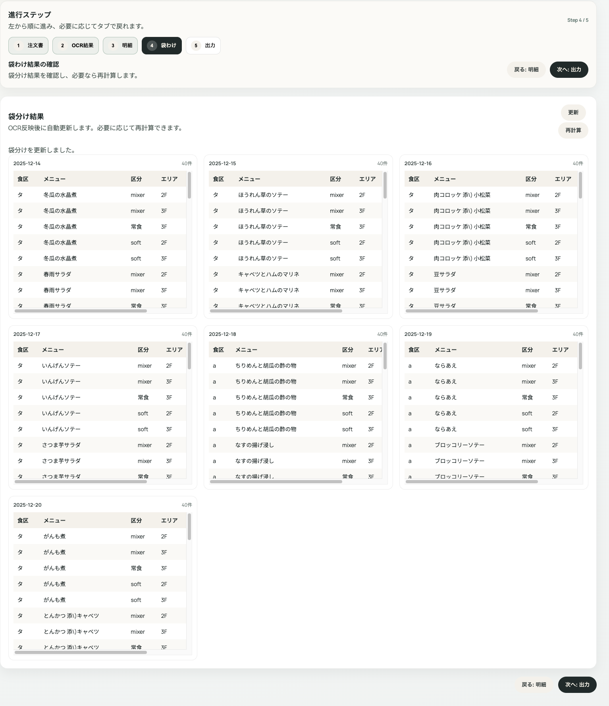

**詰まりポイント**
- 数量が合わない → OCR修正 → 再計算

---

### 6.7 出力（ダウンロード）
**操作**
- 必要な出力をダウンロード
  - ラベルCSV
  - 納品書Excel
  - 総量CSV

> **スクショ**: 出力セクション  
> 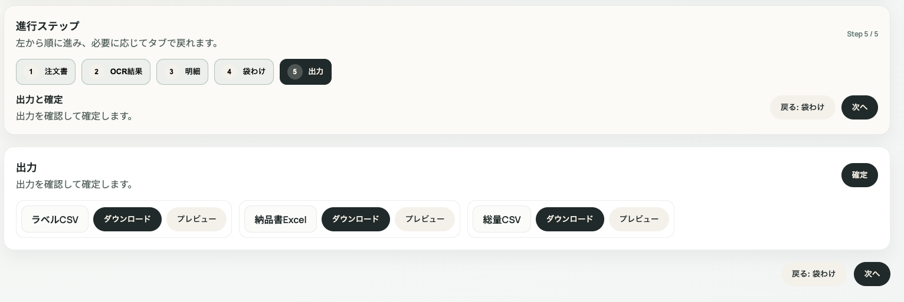

**詰まりポイント**
- ダウンロードできない → ボタンを再押下 → それでもダメなら管理者へ

---

## 7. 施設一覧（施設マスター）
### 7.1 施設一覧
- 施設名・住所・電話番号を確認します。

> **スクショ**: 施設一覧  
> 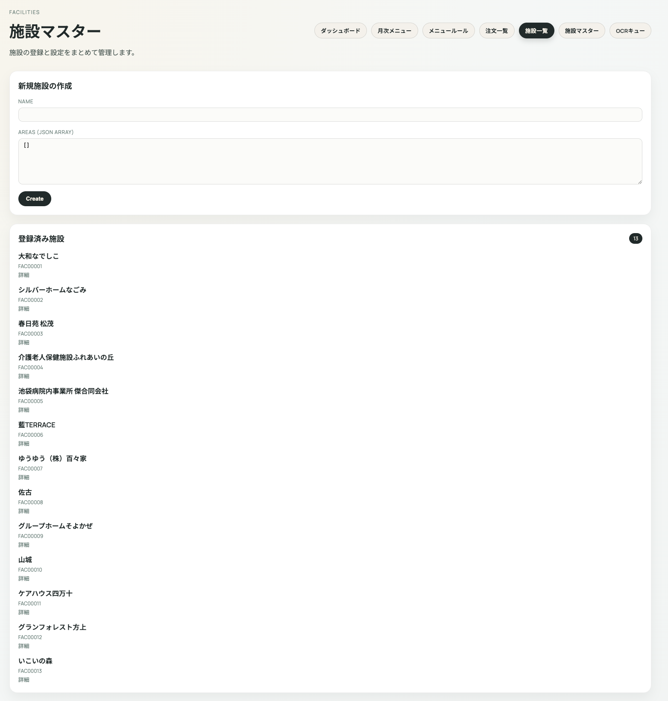

### 7.2 施設詳細
- 施設名／住所／電話番号を編集

> **スクショ**: 施設詳細  
> 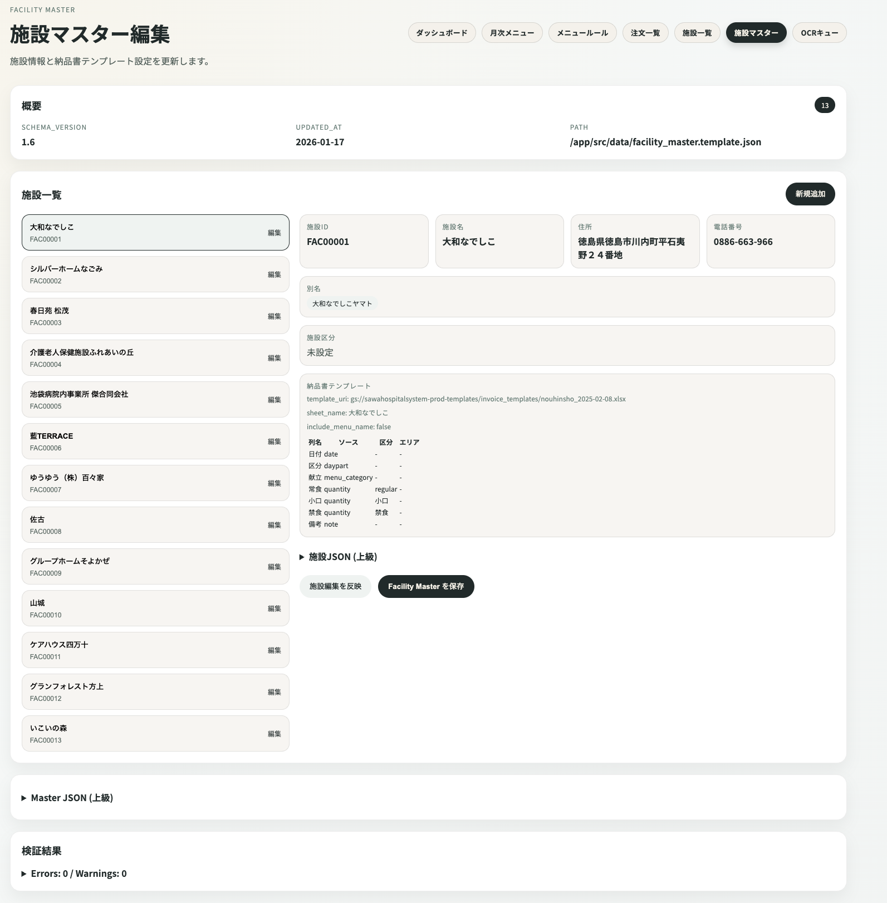

**詰まりポイント**
- 施設が出ない → 管理者へ連絡

---

## 8. 月次メニュー
**操作**
1. 月次メニューExcelをアップロード
2. メニュー表が表示される
3. 単位・温冷・袋種類を確認／修正

> **スクショ**: 月次メニュー  
> 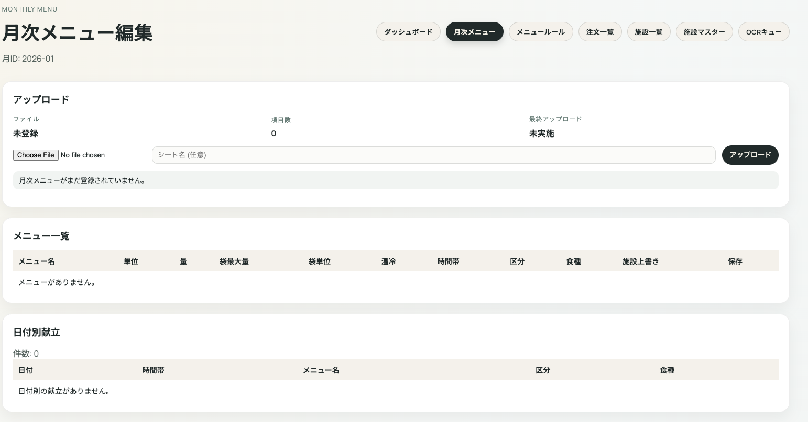

**詰まりポイント**
- 単位や温冷が空 → メニューを手動入力

---

## 9. メニュールール
- 袋分けの基本ルールと例外ルールを管理します。

> **スクショ**: メニュールール  
> 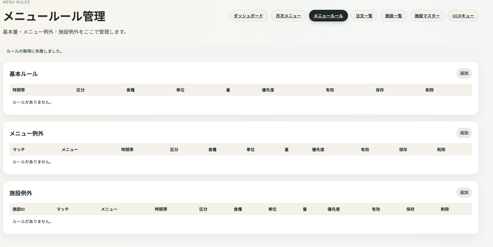

**詰まりポイント**
- ルールが合わない → 例外ルールを追加

---

## 10. OCR Queue（OCR処理状況）
- OCRの実行履歴・失敗理由を確認できます。

> **スクショ**: OCR Queue  
> 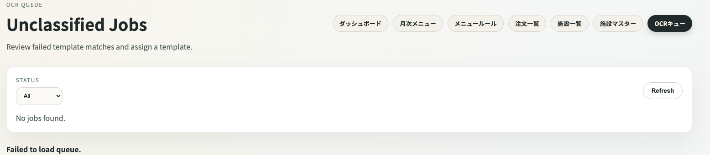

---

## 11. よくある質問・詰まりポイント
**Q1. 注文一覧にFAXが出ない**  
→ OCR Queue を確認、失敗なら管理者へ

**Q2. OCR結果が空**  
→ OCR修正を行い、再計算

**Q3. 袋分け結果が出ない**  
→ OCR結果の反映をやり直す

**Q4. ダウンロードできない**  
→ ブラウザの再読込／ボタン再押下

---

## 12. トラブルシューティング
### 12.1 ログインできない
- 管理者に連絡

### 12.2 OCR実行が止まる
- 時間を置いて再実行
- それでもダメなら管理者へ

### 12.3 レイアウトが合わない
- 自動調整 → 手動調整

---

## 13. 運用ルール（責任者・締切）
- **締切時間**: 未記入（例: 当日 10:30 まで）
- **優先順位**: 未記入（例: 緊急注文 → 当日分 → 明日分）
- **最終確認者**: 未記入（氏名/役職）
- **修正の判断基準**: 未記入（例: OCR誤読が3件以上なら再解析）
- **保留の判断基準**: 未記入（例: 施設が特定できない場合は保留）

## 14. 出力ファイルの扱い（保存・共有）
- **保存先**: 未記入（例: 共有ドライブ/指定フォルダ）
- **ファイル名ルール**: 未記入（例: 日付_施設名_納品書.xlsx）
- **共有方法**: 未記入（例: メール添付 / 共有ドライブ / 印刷）
- **保管期間**: 未記入（例: 6か月）

## 15. 連絡フロー（エスカレーション）
- **一次連絡先**: 未記入（担当者名・連絡先）
- **二次連絡先**: 未記入（担当者名・連絡先）
- **緊急連絡先**: 未記入（担当者名・連絡先）
- **連絡が必要なケース**:\n  - OCRが連続で失敗\n  - 施設が特定できない\n  - 出力ファイルが作成できない

---

## 16. スクショ差し替え用ディレクトリ
- `workspace/docs/user_manual_screenshots/`
- 本文のファイル名と一致させてください

---

## 17. 付録A. 用語
- **OCR**: 画像から文字を読み取る処理
- **オーバーレイ**: OCRの認識結果を画像上に重ねて表示する機能
- **袋分け**: 施設区分・数量に応じて分割する処理
